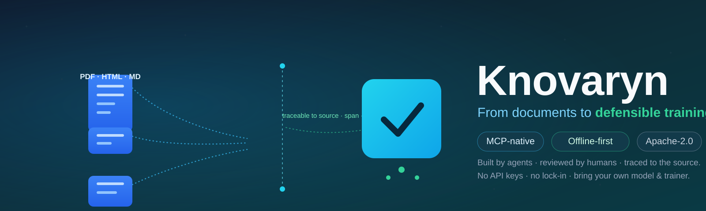

<p align="center">
  <b>Knovaryn</b>
</p>

<h1 align="center">Knovaryn — open-source, MCP-native training-data foundry</h1>

<p align="center">
  Turn <i>permitted</i> PDFs and documents into <b>traceable, quality-gated SFT,
  DPO/preference, KTO, and evaluation datasets</b> that any MCP-capable agent
  can build, review, and export — <b>every example traced to its source</b>.
</p>

<p align="center">
  <a href="https://www.python.org/downloads/"></a>
  <a href="LICENSE"></a>
  <a href="https://modelcontextprotocol.io/"></a>
  
</p>

<p align="center">
  
</p>

---

## Status

> **Alpha (`0.1.1`)** — the core pipeline, provenance, quality gates, durable
> jobs, MCP/REST/CLI/SDK interfaces, and release integrity are implemented and
> tested (400+ offline tests). Public **beta** is pending owner acceptance; the
> project is **not yet a stable release** and APIs may change. No change is
> auto-published — publishing is always an explicit, gated action.

---

## 1. Install

One command, no API keys, no network needed to get started:

```bash
pip install knovaryn
```

From source (for development):

```bash
git clone https://github.com/waalwalker1/knovaryn.git
cd knovaryn
uv sync --dev
```

Optional extras are opt-in: `docling`, `docetl`, `litellm`, `s3`, `parquet`,
`hub`, `mcp`, `ml`. See the [configuration reference](docs/reference/config.md).

## 2. 90-second offline demo

The demo runs the complete pipeline on bundled sample documents with a
deterministic fake provider — **no API keys, no network**:

```bash
uv run knovaryn demo --examples 20 --json
uv run knovaryn doctor        # environment + storage health
```

In about 90 seconds you get a release bundle: dataset card, per-file manifest,
quality/source/license/privacy reports, lineage, and a detached checksum.

## 3. Real-document quickstart

Point Knovaryn at documents you are permitted to use and drive the pipeline
through the MCP tools (or REST / SDK):

1. `knovaryn_create_project` — create a project.
2. `knovaryn_add_source` — add permitted documents with declared licenses.
3. `knovaryn_estimate_run` — dry-run cost estimate.
4. `knovaryn_start_pipeline` — run SFT / preference / KTO / evaluation.
5. `knovaryn_validate_dataset` — quality gates quarantine failures.
6. `knovaryn_create_dataset_version` + `knovaryn_export_dataset` — ship it.

See [PDF → SFT dataset](docs/guides/pdf-to-sft-dataset.md),
[build DPO preference data](docs/guides/build-dpo-preference-data.md), and
[grounded QA datasets](docs/guides/grounded-qa-dataset-from-documents.md).

## 4. MCP quickstart

Knovaryn is an **MCP training-data server**: a 23-tool Model Context Protocol
server any MCP-capable agent can drive.

```
pip install "knovaryn[mcp]"
knovaryn-mcp                     # stdio (default MCP host transport)
# or remote over Streamable-HTTP:
knovaryn-mcp --transport streamable-http --host 127.0.0.1 --port 8000
```

Connect your agent and ask it to build a dataset — see
[MCP training-data server](docs/guides/mcp-training-data-server.md) and
[MCP clients](docs/guides/mcp-clients.md).

## 5. What it produces

A Knovaryn release is an **immutable, versioned bundle**:

- trainer-ready records in JSONL / Parquet and framework layouts (`trl_sft`,
  `trl_preference`, `kto`, `sharegpt`, `alpaca`, `openai_chat`,
  `huggingface_layout`, `evaluation`);
- a dataset card, per-file manifest, quality/source/license/privacy reports;
- a **detached checksum** + reproducible bundle, verified with
  `knovaryn verify-release`.

## 6. Traceability (a concrete example)

Every exported row carries `source_document_ids`, `source_span_ids`, and a
`content_hash`. You can walk any example backward:

```
TrainingExample → chunk → SourceSpan → ParsedDocument → SourceDocument
                                                          → exact page + section
```

The export **provenance gate** resolves every document/span reference to an
existing record in the same project and recomputes the content hash. A row that
cannot be resolved **blocks the export** — Knovaryn never returns a "successful"
export it cannot defend.

## 7. Quality and policy gates

Candidates are scored against a dated acceptance policy and pass fail-closed
gates — **failure means quarantine, never silent export**:

- **schema** · **grounding** · **completeness/answerability** · **format**
- **refusal** · **duplicate** · **contamination** (train/val/test leakage)
- **privacy** · **license**

Human review (`knovaryn_review_example`) records an approve/reject decision as a
new **immutable revision** — it never mutates an example in place. See
[quality gates](docs/concepts/quality-gates.md).

## 8. Supported stack

| Concern | Supported |
|---|---|
| **Inputs** | PDF, Markdown, office/documents (via Docling), local files, archives; URL ingestion opt-in |
| **Topologies** | SFT, DPO/preference, KTO, evaluation (grounded QA) |
| **Exporters** | JSONL, Parquet; TRL, ShareGPT, Alpaca, OpenAI chat, Hugging Face layout |
| **Providers** | Offline deterministic fake provider; LiteLLM gateway (OpenAI-/Anthropic-/DeepSeek-compatible) |
| **Deployment** | Local (SQLite + filesystem); team (PostgreSQL + S3-compatible); Docker / Compose / Kubernetes |
| **Interfaces** | CLI, 23-tool MCP server, REST + web console, Python SDK |

## 9. Architecture

One **application-services core** behind a durable pipeline engine, exposed
through four interfaces:

```
Source → Parse → Split → Chunk → Generate → Validate → Version → Export → Publish
```

Everything runs as durable jobs (leases, heartbeats, checkpoints, idempotency,
budgets) so a crash resumes instead of redoing paid work. Diagrams (system
architecture, pipeline flow, durable jobs, MCP session, security, value):

**[Architecture at a glance →](docs/architecture/readme-diagrams.md)**

## 10. Security & privacy

- **Offline-first** — no credentials required for the demo, tests, or first run.
- **Secrets from the environment only** — never hard-coded, never logged,
  redacted at the display boundary.
- **Secure intake** — path-traversal/symlink protection, verified archives, URL
  ingestion off by default, SSRF defenses, loopback HTTP binding, no
  shell-command MCP tools.
- **Publication is dry-run by default** and gated on license approval — nothing
  is pushed anywhere without explicit action. See
  [license & privacy](docs/concepts/license-and-privacy.md).

## 11. Benchmarks (methodology & limitations)

Reproducible benchmarks cover parse fidelity, lineage resolution, generation
validity, groundedness, duplicate/leakage rate, pipeline throughput, crash
recovery, and export compatibility. **Honest framing:** offline fake-provider
throughput measures framework overhead only — it is not synthetic-data
generation throughput or model quality. See the
[benchmark methodology](docs/marketing/benchmark-methodology.md).

## 12. Comparison — when to choose Knovaryn

Compared factually with related tools (Synthetic Data Kit, Distilabel, Docling,
Easy Dataset) in the [peer landscape](docs/peers/index.md) and
[comparisons](docs/comparisons/synthetic-data-kit.md): choose Knovaryn when you
want a **document-grounded, provenance-enforced, gate-and-export** foundry
driven over **MCP** — not just a parser or a composition SDK.

## 13. Documentation

- [Docs site (MkDocs)](docs/) · [Guides](docs/guides/quickstart.md) ·
  [Concepts](docs/concepts/overview.md) · [Architecture](docs/architecture/overview.md)
- [Reference — CLI](docs/reference/cli.md) · [Configuration](docs/reference/config.md) ·
  [Exporters](docs/reference/exporters.md)
- [README diagrams](docs/architecture/readme-diagrams.md)

## 14. Contributing & community

Please read [CONTRIBUTING.md](CONTRIBUTING.md), the
[code of conduct](CODE_OF_CONDUCT.md), and [SECURITY.md](SECURITY.md). See
[GOVERNANCE.md](GOVERNANCE.md), [ROADMAP.md](ROADMAP.md), and
[CHANGELOG.md](CHANGELOG.md).

## 15. License & citation

**Apache-2.0** for original code (see [LICENSE](LICENSE)). Dataset licensing is
kept separate from code licensing and governed by the source-license registry.
Third-party licenses: [LICENSES-THIRD-PARTY.md](LICENSES-THIRD-PARTY.md).

If you use Knovaryn in research, please cite it — see [CITATION.cff](CITATION.cff).
