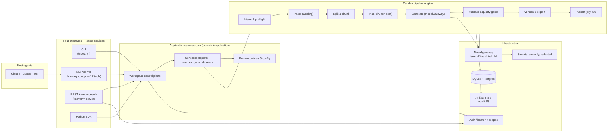
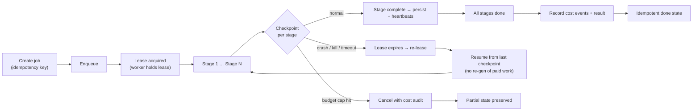
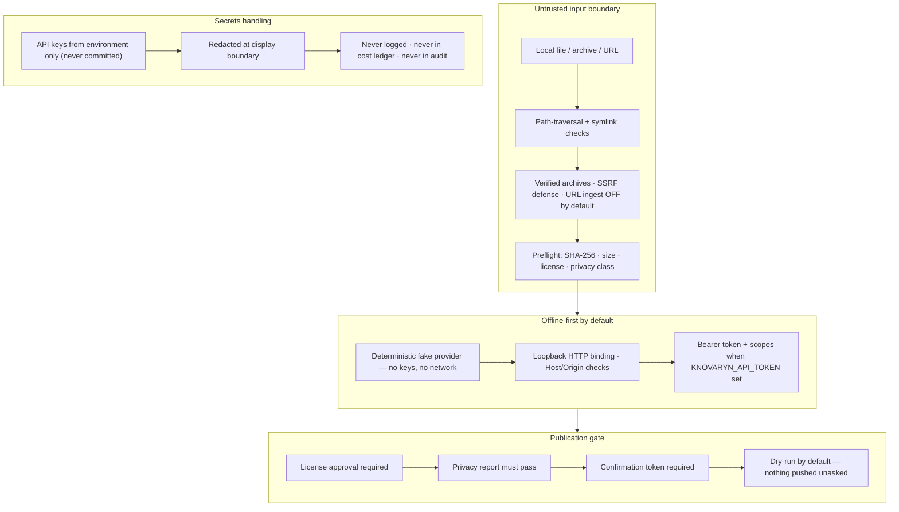
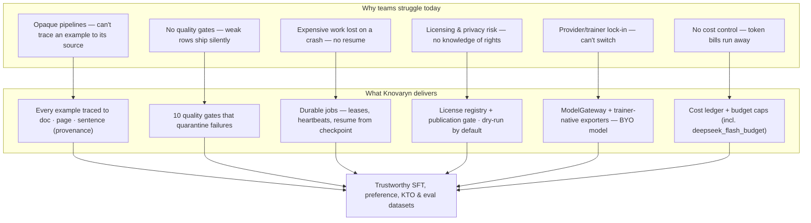

<p align="center">
  <b>Knovaryn</b>
</p>

<h1 align="center">Knovaryn</h1>

<p align="center">
  <b>Open, MCP-native training-data foundry.</b><br/>
  Turn <i>permitted</i> documents into <b>traceable, quality-gated SFT &amp; preference datasets</b>
  that any MCP-capable agent can build, review, and export.
</p>

<p align="center">
  <i>Every training example, traced to its source.</i>
</p>

<p align="center">
  <a href="https://www.python.org/downloads/"></a>
  <a href="LICENSE"></a>
  <a href="https://modelcontextprotocol.io/"></a>
  
</p>

---

## Why Knovaryn

Building high-quality LLM training data today is messy: pipelines are opaque,
sources are disconnected from the examples they produce, quality gates are manual
or nonexistent, and nothing is safe to trace back to the exact document, page, and
sentence it came from.

**Knovaryn makes dataset construction traceable, resumable, reviewable, secure, and
format-independent.** It is not simply "a PDF-to-JSONL converter" — it is a durable
lifecycle for building *trustworthy* datasets:

| Problem | Knovaryn's answer |
|---|---|
| "Where did this example come from?" | Every record carries **source spans & provenance** back to the exact document/page/sentence. |
| "How was this generated and by whom?" | Full **audit trail**, durable jobs with **leases, heartbeats, retries, and idempotency**. |
| "Is the quality good enough?" | **Schema, grounding, format, refusal, duplicate, contamination, privacy, license** gates that *quarantine* failures instead of exporting them. |
| "Do I have the rights to use it?" | Source **license registry + publication gate**; dry-run publication. |
| "How much did it cost?" | Date-stamped **cost ledger** and budget caps (incl. a low-cost `deepseek_flash_budget` runtime profile). |
| "Can I run it without paying anyone?" | Fully **offline-first** with a deterministic fake provider and zero API keys. |

---

## Feature highlights

- **Offline-first & credential-free** — the demo, tests, and first-run experience need
  **no API keys and no network** (deterministic fake provider). Real model providers
  (e.g. LiteLLM/DeepSeek) are opt-in.
- **Durable, resumable jobs** — persisted stages, leases, heartbeats, idempotency,
  cancellation, retries, budgets, cost events, and crash recovery.
- **Traceability by design** — source-span + provenance on every accepted record; raw
  secrets and confirmation tokens are cryptographic-random, never guessable.
- **Safe intake** — path-traversal & symlink protection, verified archives, URL
  ingestion *off by default*, SSRF defenses, loopback HTTP binding.
- **Canonical parsing + structure-aware chunking** — Docling canonical JSON as the
  parsed artifact, split-at-source-group, queryable provenance.
- **17-tool MCP suite + CLI + REST + Python SDK** — one application-services core,
  four interfaces.
- **Quality gates that quarantine** — grounding, completeness, format, refusal,
  artifact, dedupe, contamination, privacy, and license validators.
- **Release bundles** — dataset card, manifests, source/license/privacy/quality
  reports, lineage, checksums, and dry-run Hugging Face publication.

---

## Quickstart (no API keys, ~5 minutes)

### 0. Install

**Fastest — from PyPI** (no API keys, no source needed):

```bash
pip install knovaryn
```

**From source** (a clone with dev tooling):

```bash
# install uv (https://docs.astral.sh/uv/) if needed, then:
git clone https://github.com/waalwalker1/knovaryn.git
cd knovaryn
uv sync --dev
```

> `uv sync --dev` installs the lean core + dev tooling. It **does not** require the
> heavy optional extras (`docling`, `docetl`, `litellm`, `s3`, `hub`, `parquet`).
> Optional extras are opt-in with `uv sync --all-extras --dev`.
>
> Either route: **verify the traceability claim in 90 seconds** — see the one-pager at
> [`docs/marketing/traceability-verification.md`](docs/marketing/traceability-verification.md).

### 1. Doctor — check your environment

```bash
uv run knovaryn doctor
```

Verifies the profile, installed extras, config, and state directory.

### 2. Run the full offline demo

```bash
uv run knovaryn demo --examples 20 --json
```

Runs the complete loop (parse → plan → chunk → generate → validate → version →
export) on bundled sample documents with the fake provider. Output is a release
bundle (dataset card, manifests, reports, checksums) plus a `result.json`.

### 3. Serve the local REST API + web console

```bash
uv run knovaryn server --host 127.0.0.1 --port 8000
```

Open <http://127.0.0.1:8000> for the web console. API docs at
<http://127.0.0.1:8000/docs>. The server binds loopback by default; auth is
enforced when `KNOVARYN_API_TOKEN` is set.

### 4. Verify & run tests

```bash
uv run pytest -m "not live" -q        # 233 tests, offline, deterministic
uv run ruff check src tests           # lint
uv run mypy src/knovaryn              # types
```

---

## Interfaces

Knovaryn exposes the **same application services** through four interfaces:

### CLI (`knovaryn`)

| Command | Purpose |
|---|---|
| `knovaryn demo` | Run the fully-offline end-to-end pipeline on bundled sample documents. |
| `knovaryn doctor` | Check environment, configuration, and storage health. |
| `knovaryn repair` | Verify database integrity and reconcile missing artifact blobs. |
| `knovaryn backup` | Snapshot the local state directory into a timestamped archive. |
| `knovaryn server` | Serve the offline REST API + web console (bearer-token aware). |
| `knovaryn version` | Print the installed version. |

### MCP server (17 tools)

The `knovaryn_mcp` server exposes the full `knovaryn_*` tool set for any
MCP-capable agent. Requires the `mcp` package (see `docs/guides/mcp-clients.md`):

```
knovaryn_create_project       knovaryn_add_source            knovaryn_inspect_source
knovaryn_estimate_run         knovaryn_start_pipeline        knovaryn_get_job
knovaryn_run_job              knovaryn_cancel_job            knovaryn_resume_job
knovaryn_preview_examples     knovaryn_review_example        knovaryn_validate_dataset
knovaryn_create_dataset_version knovaryn_export_dataset      knovaryn_publish_dataset
knovaryn_compare_runs         knovaryn_license_report        knovaryn_doctor
```

### REST + web console (`knovaryn server`)

Bearer-token–aware control plane: projects, sources, pipeline jobs
(start/run/cancel/resume), license report, validation, versioning, export, publish.
Interactive docs at `/docs`, web console at `/`.

### Python SDK

Import the application services directly:

```python
from knovaryn.application.workspace import Workspace

ws = Workspace(database_url="sqlite+aiosqlite:///./.knovaryn/knovaryn.db", principal="me")
```

---

## How it works

**Source → Parse → Split → Chunk → Generate → Validate → Version → Export → Publish**

1. **Intake** permitted documents (local files, archives; URL ingestion opt-in).
2. **Parse** into canonical Docling JSON (Markdown is a derivative).
3. **Split at source-group**, then **structure-aware chunk** with heading paths,
   spans, and provenance.
4. **Generate** SFT / preference / KTO / evaluation examples from plans, against a
   model gateway (fake provider offline, LiteLLM opt-in).
5. **Validate** through schema, grounding, format, refusal, artifact, dedupe,
   contamination, privacy, and license gates — **quarantine** failures.
6. **Version** and **export** a release bundle (JSONL splits, dataset card,
   manifests, reports, checksums); publish to Hugging Face is dry-run by default.

Everything runs as **durable jobs**: persisted stages, leases, heartbeats,
idempotency, cancellation, retries, budgets, cost events, and crash recovery.

---

## Repository layout

```
├── alembic.ini                # Alembic migration config
├── migrations/                # SQLAlchemy/Alembic migration baseline (async)
├── src/knovaryn/
│   ├── domain/                # entities, policies, ports, config, hashing, errors, schemas
│   ├── application/           # service + workspace control plane
│   ├── pipeline/              # planner, split, generate, quality, export, jobs
│   ├── infrastructure/        # database, artifacts, docling, intake, models, auth, telemetry
│   ├── interfaces/            # cli, mcp, rest
│   └── prompts/               # versioned prompt library + manifest
├── tests/                     # 233 offline tests (incl. migration + artifact CAS)
├── benchmarks/                # offline pipeline benchmark
├── deploy/                    # Docker / Compose / Kubernetes reference
├── docs/                      # full documentation site (MkDocs)
└── fixtures/                  # bundled sample documents for the offline demo
```

---

## Architecture, workflows & value — at a glance

Six diagrams, one mental model. Each is available both as a rendered PNG
(`docs/assets/*.png`) and as raw Mermaid source (`docs/assets/diagrams/*.mmd`)
so you can browse, edit, or embed them anywhere Mermaid is supported (GitHub,
MkDocs, Notion).

### 1. System architecture — one core, four interfaces

Everything sits on a single **application-services core** (domain + application)
behind a durable pipeline engine. Four interfaces — CLI, the 17-tool MCP server,
REST + web console, and the Python SDK — all drive the *same* services, so a job
started from the CLI is visible everywhere.

<p align="center">
  
</p>



### 2. End-to-end pipeline flow — every example traced to its source

```mermaid
flowchart LR
    subgraph INPUT["1 · Intake — permitted documents"]
        direction TB
        A1["Local files"] --> A2["Path + symlink checks"]
        A3["Archives zip / tar"] --> A2
        A4["URLs — opt-in"] --> A2
        A2 --> A5["Preflight: SHA-256 · size · pages · license"]
    end

    subgraph PARSE["2 · Parse → canonical representation"]
        direction TB
        P1["Docling canonical JSON"] --> P2["Diagnostics + quality summary"]
        P2 --> P3["Markdown — derivative output"]
    end

    subgraph SPLIT["3 · Split + chunk with provenance"]
        direction TB
        S1["Split at source group"] --> S2["Structure-aware chunking"]
        S2 --> S3["Heading paths · spans · source_span_ids · sha256"]
    end

    subgraph GEN["4 · Generate examples"]
        direction TB
        G1["Planner: task + difficulty map"] --> G2["Prompt library"]
        G2 --> G3["SFT · Preference · KTO · Eval"]
        G3 --> G4["Model gateway — fake offline or LiteLLM"]
    end

    subgraph VAL["5 · Validate — gates quarantine failures"]
        direction TB
        V1["Schema / Grounding / Completeness"]
        V2["Format / Refusal / Dedupe"]
        V3["Contamination / Privacy / License"]
        V1 --> V4{"All gates pass?"}
        V2 --> V4
        V3 --> V4
        V4 -- fail --> V5["Quarantine"]
        V4 -- pass --> V6["Review state"]
    end

    subgraph OUT["6 · Version + export + publish"]
        direction TB
        O1["Dataset version"] --> O2["Release bundle: card · manifest · reports · checksums"]
        O2 --> O3["Exporters — JSONL + variations"]
        O2 --> O4["Publish to Hugging Face — dry-run by default"]
    end

    A5 --> P1
    P3 --> S1
    S3 --> G1
    G4 --> V1
    V6 --> O1
```

<p align="center">
  
</p>



### 3. Durable jobs — nothing is lost on a crash

Every stage of the pipeline runs as a **durable job** with leases, heartbeats,
idempotency keys, checkpoints, and budget caps. A crash, kill, or timeout just
expires the lease and **resumes from the last checkpoint** — no re-generation of
paid work.

<p align="center">
  
</p>



### 4. A typical MCP agent session

From an empty workspace to a published dataset version using the 17-tool MCP
suite — exactly what a Claude/Cursor-style agent sees.

```mermaid
flowchart LR
    A["knovaryn_create_project"] --> B["knovaryn_add_source"]
    B --> C["knovaryn_inspect_source"]
    C --> D["knovaryn_license_report"]
    D --> E["knovaryn_estimate_run"]
    E --> F{"budget OK?"}
    F -->|"yes"| G["knovaryn_start_pipeline"]
    F -->|"no / tune"| E
    G --> H["knovaryn_get_job / run_job<br/>(poll progress)"]
    H --> I["knovaryn_preview_examples"]
    I --> J["knovaryn_review_example"]
    J --> K["knovaryn_validate_dataset"]
    K --> L["knovaryn_compare_runs"]
    L --> M["knovaryn_create_dataset_version"]
    M --> N["knovaryn_export_dataset"]
    N --> O["knovaryn_publish_dataset<br/>(dry-run → confirm)"]
    O --> P["knovaryn_doctor (health check)"]
```

<p align="center">
  
</p>



### 5. Security & privacy flow

Offline-first, secrets from the environment only, and nothing published unless
explicitly approved.

<p align="center">
  
</p>



### 6. Why it's useful — problem → value

<p align="center">
  
</p>



---

## Is it a product, a library, or a service?

**All three — deliberately.** Knovaryn is a single codebase that serves three
audiences:

- **As a product** — a tangible, runnable application with a CLI, a local web
  console, a REST control plane, and a polished MCP tool suite. You install it
  and it works (even fully offline).
- **As a library / SDK** — every capability is exposed through the Python SDK
  and the underlying application services, so you can embed dataset-building
  directly into your own agents, notebooks, or pipelines.
- **As a service** — over MCP or REST it behaves like a managed capability your
  agents call on demand: *"ingest this file, build SFT + preference data, gate
  it for quality, and hand me a trainer-ready JSONL bundle."*

Because all four interfaces share one core, whichever face you use, the jobs,
audit trail, cost ledger, and provenance guarantees are identical.

---

## Documentation

The full product & engineering docs live under [`docs/`](docs/) (MkDocs site):

- **Guides:** [`docs/guides/quickstart.md`](docs/guides/quickstart.md) ·
  [`docs/guides/first-real-project.md`](docs/guides/first-real-project.md) ·
  [`docs/guides/mcp-clients.md`](docs/guides/mcp-clients.md)
- **Concepts:** [overview](docs/concepts/overview.md) · [provenance](docs/concepts/provenance.md) ·
  [quality](docs/concepts/quality.md) · [preference-data](docs/concepts/preference-data.md)
- **Architecture:** [overview](docs/architecture/overview.md) · [durable jobs](docs/architecture/jobs.md) ·
  [security](docs/architecture/security.md) · [data flow](docs/architecture/diagram.md)
- **Reference:** [CLI](docs/reference/cli.md) · [configuration](docs/reference/config.md) ·
  [exporters](docs/reference/exporters.md)
- **Decision records:** [`docs/adr/`](docs/adr/index.md)

```bash
uv run mkdocs serve    # local docs site
```

---

## Security & privacy

- **Offline-first:** no credentials required for the demo, tests, or first-run.
- **Secrets are never hard-coded.** API keys are read from the environment
  (`DEEPSEEK_API_KEY`, etc.), redacted at display boundaries, and never written to
  logs, the cost ledger, or audit records.
- **Secure defaults:** path-traversal/symlink protection, safe archives, URL
  ingestion off by default, SSRF defenses, loopback HTTP binding, Host/Origin
  checks, and no shell-command MCP tools.
- **Publication is dry-run by default** and gated on license approval — nothing is
  pushed anywhere without explicit action.

> A repository-wide secret scan (gitleaks + manual) found **no exposed API keys**
> in the working tree or git history.

---

## Project status

- **Maturity:** Alpha (`0.1.0`) — public beta pending owner acceptance.
- **Changelog:** [`CHANGELOG.md`](CHANGELOG.md) · **Roadmap:** [`ROADMAP.md`](ROADMAP.md)
- **Governance:** [`GOVERNANCE.md`](GOVERNANCE.md) · **Contributing:** [`CONTRIBUTING.md`](CONTRIBUTING.md)
- **Security & disclosure:** [`SECURITY.md`](SECURITY.md)

## License

Apache-2.0 for original code (see [`LICENSE`](LICENSE)). Dataset licensing is kept
separate from code licensing and governed by the source-license registry.
Third-party licenses: [`LICENSES-THIRD-PARTY.md`](LICENSES-THIRD-PARTY.md).
