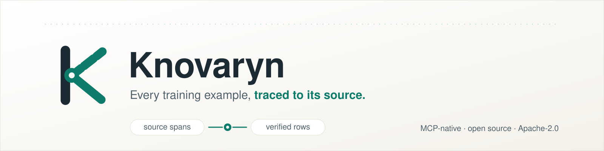
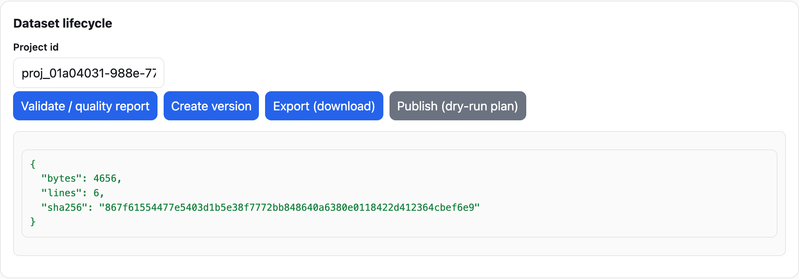
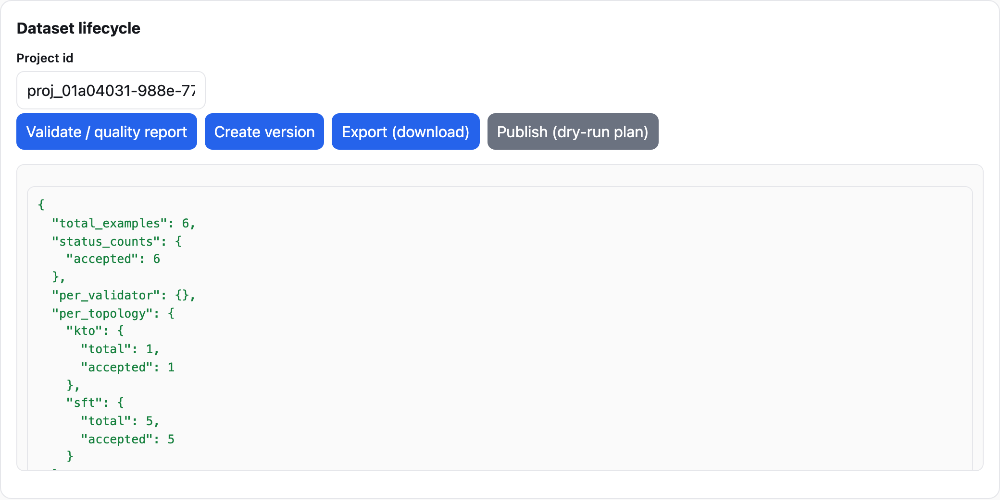

<!-- knovaryn-version: 0.2.1 -->
<!-- Current-release marker: kept equal to knovaryn.__version__ by
     scripts/check_version_sync.py. Update via `python scripts/check_version_sync.py --fix`. -->

<p align="center">
  <picture>
    <source media="(prefers-color-scheme: dark) and (max-width: 640px)" srcset="docs/assets/brand/github-readme-banner-narrow-dark.svg">
    <source media="(prefers-color-scheme: dark)" srcset="docs/assets/brand/github-readme-banner-dark.svg">
    <source media="(max-width: 640px)" srcset="docs/assets/brand/github-readme-banner-narrow.svg">
    
  </picture>
</p>

**Knovaryn** is an open-source, self-hosted, MCP-native **training-data
foundry**: it turns *permitted* PDFs and documents into **traceable,
quality-gated SFT, DPO/preference, KTO, and evaluation datasets** that any
MCP-capable agent can build, review, and export.

> **Every training example, traced to its source.** Each exported row is linked
> to persisted source evidence, quality decisions, review state, version
> metadata, and a reproducible release bundle — so you can walk any example
> back to the page, section, or chunk it came from, and prove it.

**Status: self-hosted open-source alpha (`0.2.1`).** You run Knovaryn on your
own machine or infrastructure — there is **no hosted service**. The bundled
demo runs entirely offline on a deterministic fake provider: **no API keys, no
network**. Live model generation is an explicit opt-in. Maturity and
limitations are listed honestly [below](#maturity-and-limitations).

<p align="center">
  <a href="https://pypi.org/project/knovaryn/"></a>
  <a href="https://pypi.org/project/knovaryn/"></a>
  <a href="https://github.com/waalwalker1/knovaryn/actions/workflows/ci.yml"></a>
  <a href="https://waalwalker1.github.io/knovaryn/"></a>
  <a href="docs/adr/0007-dual-major-mcp-sdk-compatibility.md"></a>
  <a href="LICENSE"></a>
  <a href="SECURITY.md"></a>
  <a href="docs/reference/claim-matrix.md"></a>
</p>

**Start here:** [install from PyPI](https://pypi.org/project/knovaryn/) ·
[run the offline demo](#run-the-offline-demo-no-api-keys) ·
[read the quickstart](docs/guides/quickstart.md) ·
[connect an MCP client](docs/guides/mcp-clients.md) ·
[view the documentation](https://waalwalker1.github.io/knovaryn/) ·
[inspect an example release](https://github.com/waalwalker1/knovaryn/releases) ·
[contribute](CONTRIBUTING.md)

---

## Why Knovaryn

Applied-LLM teams generate "N examples" with no way to show where an example
came from, whether it is any good, or whether the source was usable at all.
Knovaryn treats **evidence and acceptance decisions as first-class data**:

- **Provenance is enforced, not decorative.** Every accepted example carries
  `source_document_ids`, `source_span_ids`, and a `content_hash`; exports are
  blocked if a reference cannot be resolved to real evidence.
- **Quality gates fail closed.** Candidates are scored against a dated
  acceptance policy; failures are quarantined with reason codes — never
  silently exported.
- **Expensive work is durable.** Jobs run on leased workers with heartbeats,
  checkpoints, and idempotency keys — a crash resumes instead of redoing paid
  work.
- **MCP is the primary interface.** 23 typed tools mirror the CLI verbs; any
  MCP-capable agent can drive the whole pipeline. The tool surface is tested
  against both MCP SDK major lines (`mcp>=1.28,<3`).
- **Local-first, team-ready.** SQLite + filesystem by default; PostgreSQL +
  S3-compatible storage is a configuration change, not a code fork.
- **Honest by construction.** Quality is measured *relative to a policy and
  corpus*; the [claim matrix](docs/reference/claim-matrix.md) ties every
  public claim to evidence and known limitations.

Compared factually with related tools in the
[peer landscape](docs/peers/index.md).

## How it works


Everything runs as durable jobs; the full diagram set (system architecture,
durable jobs, MCP session, security, value) is in
[architecture at a glance](docs/architecture/readme-diagrams.md).

## Install

One command, no API keys, no network needed to get started:

```bash
pip install knovaryn
```

From source (for development):

```bash
git clone https://github.com/waalwalker1/knovaryn.git
cd knovaryn
uv sync --extra dev
```

Optional extras are opt-in: `docling`, `docetl`, `litellm`, `s3`, `parquet`,
`hub`, `mcp`, `ml`. See the [configuration reference](docs/reference/config.md).

## Run the offline demo (no API keys)

The demo runs the complete pipeline on bundled sample documents with a
deterministic fake provider — **no API keys, no network**:

```bash
uv run knovaryn demo --examples 20 --json
uv run knovaryn doctor        # environment + storage health
```

In about 90 seconds you get a release bundle: dataset card, per-file manifest,
quality/source/license/privacy reports, lineage, and a detached checksum.
The full command lifecycle (project → source → run → review → dataset) is in
the [CLI reference](docs/reference/cli.md).

The same lifecycle is drivable from the browser console that ships with the
REST server (`knovaryn server`):

<a href="docs/assets/screenshots/offline-demo.gif"></a>
*24-second silent walkthrough — source → run → quality result → provenance → export. Every frame is the real console driven against the [deterministic demo workspace](scripts/visuals/record_demo.md); the GIF is linked (not autoplaying here) so motion-sensitive readers can skip it, and the scene table in that guide is a full transcript.*

## Use it over MCP

Knovaryn is an **MCP training-data server**: a Model Context Protocol server
any MCP-capable agent can drive. The authoritative tool catalogue is generated
from the server registration — see [MCP tools](docs/reference/mcp-tools.md).
Supported MCP SDK range: `mcp>=1.28,<3` (an acceptance matrix exercises both
the 1.x and 2.x lines over stdio and authenticated streamable HTTP — see
[ADR-0007](docs/adr/0007-dual-major-mcp-sdk-compatibility.md)).

```
pip install "knovaryn[mcp]"
knovaryn-mcp                     # stdio (default MCP host transport)
# or remote over Streamable-HTTP:
knovaryn-mcp --transport streamable-http --host 127.0.0.1 --port 8000
```

Connect your agent and ask it to build a dataset — see
[MCP training-data server](docs/guides/mcp-training-data-server.md) and
[MCP clients](docs/guides/mcp-clients.md).

For real documents, drive the pipeline through the MCP tools (or REST / SDK):
`knovaryn_create_project` → `knovaryn_add_source` (permitted documents, declared
licenses) → `knovaryn_estimate_run` (dry-run cost) → `knovaryn_start_pipeline` →
`knovaryn_validate_dataset` → `knovaryn_create_dataset_version` +
`knovaryn_export_dataset`. Walkthroughs:
[PDF → SFT dataset](docs/guides/pdf-to-sft-dataset.md),
[build DPO preference data](docs/guides/build-dpo-preference-data.md),
[grounded QA datasets](docs/guides/grounded-qa-dataset-from-documents.md).

## What Knovaryn produces

A Knovaryn release is an **immutable, versioned bundle**:

- trainer-ready records in JSONL / Parquet and framework layouts (`trl_sft`,
  `trl_preference`, `kto`, `sharegpt`, `alpaca`, `openai_chat`,
  `huggingface_layout`, `evaluation`) — generated table in the
  [exporter reference](docs/reference/exporters.md);
- a dataset card, per-file manifest, quality/source/license/privacy reports;
- a **detached checksum** + reproducible bundle, verified with
  `knovaryn verify-release`.



| Concern | Supported |
|---|---|
| **Inputs** | PDF, Markdown, office/documents (via Docling), local files, archives; URL ingestion opt-in |
| **Topologies** | SFT, DPO/preference, KTO, evaluation (grounded QA) |
| **Providers** | Offline deterministic fake provider; LiteLLM gateway (OpenAI-/Anthropic-/DeepSeek-compatible) |
| **Deployment** | Local (SQLite + filesystem); team (PostgreSQL + S3-compatible); Docker / Compose / Kubernetes |
| **Interfaces** | CLI, MCP server, REST + web console, Python SDK |

## Traceability: walk any example home

Every exported row carries `source_document_ids`, `source_span_ids`, and a
`content_hash`:

```
TrainingExample → chunk → SourceSpan → ParsedDocument → SourceDocument
                                                          → location + precision
```

Every span carries a machine-verifiable **location precision**, derived from
what the parser actually recorded — never asserted by callers: `exact_bbox`
(page + bounding boxes, Docling-backed documents), `exact_page`, `page_range`,
`section`, `chunk`, or `unknown`. Markdown and plain-text sources honestly
report section/chunk granularity instead of fabricating page numbers; lineage
(API `/v1/projects/{id}/examples/{eid}/lineage`, MCP `knovaryn_lineage`) returns
the per-span precision so consumers can verify provenance claims.


The export **provenance gate** resolves every document/span reference to an
existing record in the same project and recomputes the content hash. A row that
cannot be resolved **blocks the export** — Knovaryn never returns a "successful"
export it cannot defend.

## Quality gates and human review

Candidates are scored against a dated acceptance policy and pass fail-closed
gates — **failure means quarantine, never silent export**:

- **schema** · **grounding** · **completeness/answerability** · **format**
- **refusal** · **duplicate** · **contamination** (train/val/test leakage)
- **semantic consistency** — deterministic contradiction checks
  (`offline-fast`, default), optionally extended by a cited-evidence-only LLM
  judge (`certified-semantic`; deterministic contradictions are final, an
  unavailable judge yields *unverified*, never *verified*)
- **preference signal** (DPO/KTO pairs) and **information gain**
- **privacy** · **license**

Human review (`knovaryn_review_example`) records an approve/reject decision as
a new **immutable revision** — it never mutates an example in place. The gate
list is generated from validator registration:
[quality gates](docs/reference/quality-gates.md); validation profiles are in
[validation profiles](docs/reference/profiles.md).



## Benchmarks, with their limitations

Reproducible benchmark suites cover parse fidelity, lineage resolution,
generation validity, groundedness, duplicate/leakage rate, pipeline overhead,
crash recovery, and export compatibility; semantic-judge quality is measured as
false-accept / false-reject rates with Wilson confidence intervals against an
adversarial corpus. **Honest framing:** offline fake-provider throughput
measures framework overhead only — it is not synthetic-data generation
throughput or model quality. Current numbers:
[report 0.2.1](benchmarks/report-0-2-1.md), methodology in
[benchmark methodology](docs/reference/benchmark-methodology.md) — reproduce
them before relying on them.

## Security and privacy

- **Offline-first** — no credentials required for the demo, tests, or first run.
- **Secrets from the environment only** — never hard-coded, never logged,
  redacted at the display boundary.
- **Secure intake** — path-traversal/symlink protection, verified archives, URL
  ingestion off by default, SSRF defenses, loopback HTTP binding, no
  shell-command MCP tools.
- **Publication is dry-run by default** and gated on license approval — nothing
  is pushed anywhere without explicit action. See
  [license & privacy](docs/concepts/license-and-privacy.md) and
  [hardening](docs/security/hardening.md). Report vulnerabilities per
  [SECURITY.md](SECURITY.md).

## Maturity and limitations

- **Alpha software (`0.x`)**: APIs, storage layout, and the MCP surface may
  change before 1.0; do not build unmanaged long-lived dependencies on 0.x
  internals. Breaking changes are documented in the
  [changelog](CHANGELOG.md).
- The offline demo uses a deterministic fake provider — its output demonstrates
  the pipeline mechanics, not generation quality. Real datasets require real
  providers and your own review effort.
- Location precision depends on what the parser records: plain-text/markdown
  sources cannot yield page or bounding-box precision, and spans are reported
  at the honest lower granularity instead.
- Deterministic semantic checks catch specific contradiction classes only;
  they cannot prove entailment. Judge-based verification requires configured,
  reachable providers and inherits their limitations; unavailable judges fail
  closed to *unverified* rather than guessing.
- Publication gating enforces license/privacy policy inside Knovaryn; it is
  not legal clearance. You are responsible for the rights to your sources.
- Single-node SQLite mode is local-first and not multi-writer; team scale
  expects PostgreSQL plus object storage.

## Documentation

- [Docs site](https://waalwalker1.github.io/knovaryn/) ·
  [Quickstart](docs/guides/quickstart.md) ·
  [Concepts](docs/concepts/overview.md) ·
  [Architecture](docs/architecture/overview.md)
- [Reference — CLI](docs/reference/cli.md) · [Configuration](docs/reference/config.md) ·
  [REST API](docs/reference/rest-api.md) · [MCP tools](docs/reference/mcp-tools.md) ·
  [Quality gates](docs/reference/quality-gates.md) ·
  [Validation profiles](docs/reference/profiles.md) ·
  [Exporters](docs/reference/exporters.md)
- [Claim matrix](docs/reference/claim-matrix.md) — every public claim with its
  maturity, evidence, and known limitation ·
  [Roadmap](ROADMAP.md) · [Support & FAQ](docs/support.md)

## Contributing and community

Please read [CONTRIBUTING.md](CONTRIBUTING.md), the
[code of conduct](CODE_OF_CONDUCT.md), and [SECURITY.md](SECURITY.md). See
[GOVERNANCE.md](GOVERNANCE.md) for how the project is run and
[CHANGELOG.md](CHANGELOG.md) for what changed.

## License and citation

**Apache-2.0** for original code (see [LICENSE](LICENSE)). Dataset licensing is
kept separate from code licensing and governed by the source-license registry.
Third-party licenses: [LICENSES-THIRD-PARTY.md](LICENSES-THIRD-PARTY.md).

If you use Knovaryn in research, please cite it — see [CITATION.cff](CITATION.cff).
