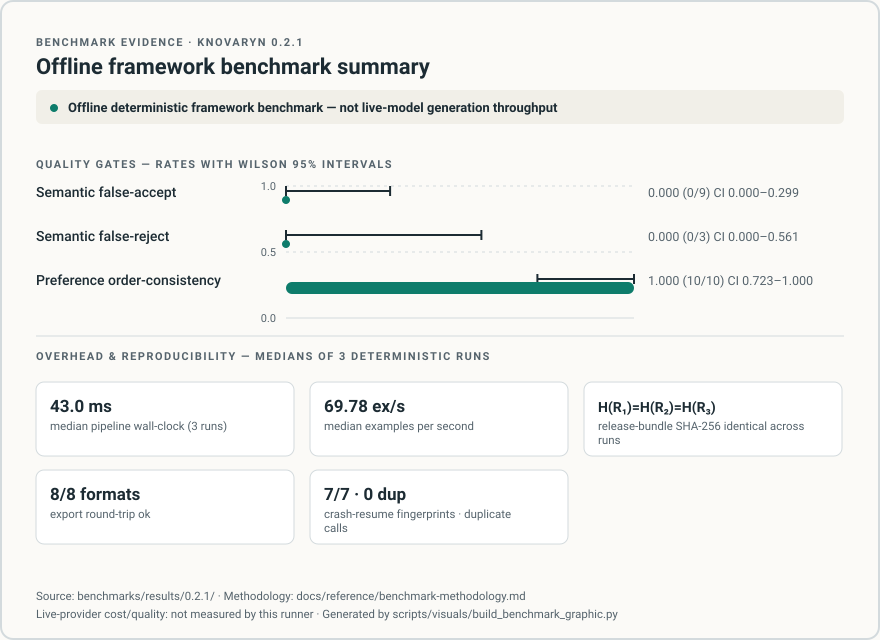

# Knovaryn Benchmark Report 0.2.1

- **Report ID / date:** knovaryn-bench-0.2.1 / 2026-08-25
- **Methodology version:** 2 — canonical text at
  [`docs/reference/benchmark-methodology.md`](../docs/reference/benchmark-methodology.md)
- **Runner:** `benchmarks/run_report.py` (results in
  [`benchmarks/results/0.2.1/`](results/0.2.1/README.md))
- **Reproducibility verdict:** `H(R₁) = H(R₂) = H(R₃)` ✅
  (`8be41bc0a4470379c873f6cbfc080f59fed908d5181aee6a8b5d8cedc5037c1a`, all three runs)

> **What this report is and is not.** Every number below is an **offline
> deterministic framework benchmark**: the pipeline ran end-to-end on the
> bundled maintainer-authored corpus with the deterministic `FakeProvider`.
> It is **not live-model generation throughput**, **not a model-quality or
> cost claim**, and makes no claim that produced data improves any downstream
> model. Live-provider cost/quality: **not measured** (no live provider was
> invoked). Context label for any reuse of these figures: *"Offline
> deterministic framework benchmark — not live-model generation throughput."*



*Visual summary generated from the committed results by
`scripts/visuals/build_benchmark_graphic.py`
([source](../docs/assets/benchmarks/benchmark-summary-0.2.1.svg)); it may show
only measured facts from this directory and always carries the context label.*

## Environment

Recorded verbatim in [`results/0.2.1/environment.json`](results/0.2.1/environment.json):
macOS (Darwin 25.5.0), Apple Silicon arm64, 10 CPU cores, CPython 3.13.7,
Knovaryn **0.2.1** (authoritative `__version__`), working tree based on commit
`2bad356…` with this pass's changes; optional extras installed during the run:
`mcp` only — **no** Docling / DocETL / LiteLLM / S3 / psycopg. No network, no
API keys, zero provider spend.

## Corpus

The four committed text fixtures (maintainer-authored, Apache-2.0, synthetic;
per-file SHA-256 pinned in each `run-N.json` under `corpus_sha256`):

| File | SHA-256 (first 12) |
|---|---|
| `multilingual.txt` | `415cb3612705` |
| `numbered-headings.md` | `a8f2598cf1eb` |
| `sample.csv` | `e7a3929e0913` |
| `sample.json` | `a2c35a8a1e57` |

Plan: task families factual_explanation 0.5 / procedure 0.3 / comparison 0.2;
difficulty basic 0.3 / intermediate 0.5 / advanced 0.2; `maximum_dataset_size`
2000. One warmup invocation per repetition set, discarded (methodology §4).

## Pipeline yield, provenance, and quality gates

Identical across all three repetitions (deterministic system):

| Metric | Value | Evidence |
|---|---|---|
| Sources ingested / parsed | 4 / 4 (**parse success rate 1.0**) | `run-N.json:parsed` |
| Chunks / evidence spans | 6 / 6 | `run-N.json:chunks,spans` |
| Candidates → examples | 6 → 3 accepted | `run-N.json:candidates,examples` |
| Accepted / quarantined / review | 3 / 0 / 0 | `quality_status_counts` |
| Provenance resolution rate | **1.000** (3/3, Wilson 95% CI 0.439–1.000) | `lineage_resolution` |
| Precision distribution | `section`: 3, `chunk`: 3 | `precision_distribution` |

The precision histogram shows honest degradation: markdown/text sources cap at
`section`/`chunk` precision — no fabricated page numbers (the `exact_bbox` /
`exact_page` classes require layout-aware parsers such as Docling, not used
here).

## Semantic adversarial quality (deterministic layer)

14 labeled cases from the CI-asserted corpus
(`tests/semantic/test_semantic_benchmark.py`); 9 contradiction-class, 3
entailment-class, 2 correctly-`unverified` conflict classes.

| Rate | Value | Wilson 95% CI |
|---|---|---|
| **False-accept** (expected contradicted → observed entailed) | **0.000** (0/9) | 0.000–0.299 |
| **False-reject** (expected entailed → observed contradicted) | **0.000** (0/3) | 0.000–0.562 |
| Unverified on entailment cases (coverage limit, neither FA nor FR) | 1.000 (3/3) | 0.439–1.000 |

Interpretation: the deterministic layer never accepted an expected
contradiction and never contradicted an expected entailment; paraphrase and
multi-sentence entailment remain outside its rule coverage and are reported
`unverified` — which downstream gating treats as *not verified*, never as
verified. The `certified-semantic` judge layer is **not measured** here
(requires a reachable judge provider).

## Preference quality (certified pairwise, scripted deterministic scores)

| Metric | Value | Wilson 95% CI |
|---|---|---|
| Two-order consistency (chosen preferred in both presentation orders) | **1.000** (10/10) | 0.723–1.000 |
| Both-good pairs routed to review (never passed) | **1.000** (3/3) | 0.439–1.000 |
| Identical-pair rejection | **1.000** (3/3) | 0.439–1.000 |
| Near-duplicate rejection (cosmetic edit only) | **1.000** (3/3) | 0.439–1.000 |
| Information-gate: no-signal candidate rejection | **1.000** (3/3) | 0.439–1.000 |
| Information-gate: substantive-candidate retention | **1.000** (2/2) | 0.342–1.000 |

Judge identity: `CertifiedPairwiseJudge` over deterministic scripted scores.
Live-judge certification inherits real-provider limitations and is **not
measured** here.

## Framework overhead and memory (not generation throughput)

| Metric | Run 1 | Run 2 | Run 3 | Median |
|---|---|---|---|---|
| End-to-end elapsed (s) | 0.0427 | 0.0448 | 0.0430 | **0.0430** |
| Examples / second | 70.21 | 66.90 | 69.78 | **69.78** |
| Peak allocated bytes | 622,822 | 577,866 | 656,471 | **622,822** |

Per-methodology §15 the per-run timing/memory values are committed unedited in
`results/0.2.1/run-{1,2,3}.json`; `aggregate.json` carries the medians. These
numbers bound the *non-model* framework cost on this machine only; they do not
transfer to other hardware and say nothing about live-provider latency.

## Release reproducibility

| Metric | Value |
|---|---|
| Release-bundle size | 3054 bytes (all runs) |
| H(R₁) = H(R₂) = H(R₃) | **true** — single digest across all repetitions |
| Digest | `8be41bc0a4470379c873f6cbfc080f59fed908d5181aee6a8b5d8cedc5037c1a` |

This guarantee is new at 0.2.1: release bundles previously inherited
wall-clock UUIDv7 handles, so digests drifted between identical runs (visible
in the historical [report-0-1-0](report-0-1-0.md) bundle sizes). The fix is
opt-in seeded identifiers (`IdGenerator(seed=...)`) for reproducible-mode
runs; production IDs remain unguessable UUIDv7s. Regression tests:
`tests/test_reproducible_release_digest.py`.

## Crash recovery (kill + resume scenario)

A worker died hard mid-pipeline (provider raised after 2 paid calls); a
replacement worker reclaimed the expired-lease job and resumed through the
`JobEngine`:

| Metric | Value |
|---|---|
| Crash reproduced mid-pipeline | yes |
| Resume outcome | **succeeded** (1/1 scenarios) |
| Provider invocations total / unique request fingerprints | 7 / 7 |
| Duplicate provider calls after resume | **0** |
| Duplicate cost events after resume | **0** |

## Export compatibility

All eight formats round-trip with non-empty output, resolvable lineage, and a
detached SHA-256: `alpaca`, `evaluation`, `huggingface_layout`, `kto`,
`openai_chat`, `sharegpt`, `trl_preference`, `trl_sft` — status `ok` for every
format in every repetition.

## Executed separately (cited evidence, not re-measured here)

| Item | Result | Where |
|---|---|---|
| MCP dual-SDK lifecycle (stdio + authenticated streamable HTTP + bind refusal) | see below | `scripts/mcp_acceptance_matrix.py`, required CI job `compat.yml` |
| PostgreSQL + MinIO compose E2E | not measured on this machine (Docker daemon unavailable); enforced by `.github/workflows/deploy-e2e.yml` at release time | `tests/deployment/test_compose_e2e.py` |
| Optional Docling layout/OCR | not measured — `docling` extra not installed in this environment (recorded in `environment.json`) | corpus README table tier |

### MCP acceptance-matrix result (executed 2026-08-27, this machine)

Clean-venv install of the built wheel against every pinned SDK version in
the matrix (`scripts/mcp_acceptance_matrix.py`, exit code 0 — ALL CELLS PASS;
matrix = 1.28.0 / 1.29.1 / 2.0.0 / 2.1.0, matching ADR-0007):

| Cell | Version check | stdio lifecycle | Streamable HTTP (auth) | Non-loopback bind refusal |
|---|---|---|---|---|
| `mcp==1.28.0` | ok (installed 1.28.0) | ok — 23 tools, 6 templates, 3 example flows, no thread leaks | ok | refused |
| `mcp==1.29.1` | ok (installed 1.29.1) | ok — 23 tools, 6 templates, 3 example flows, no thread leaks | ok | refused |
| `mcp==2.0.0` | ok (installed 2.0.0) | ok — 23 tools, 6 templates, 3 example flows, no thread leaks | ok | refused |
| `mcp==2.1.0` | ok (installed 2.1.0) | ok — 23 tools, 6 templates, 3 example flows, no thread leaks | ok | refused |

## Not measured (explicit)

- **Live-provider cost** — no live provider invoked; zero spend occurred.
- **Live-provider generation quality** — fake provider only.
- **Downstream model improvement** — out of scope until v0.4's independent
  evaluation milestone ([ROADMAP](../ROADMAP.md)).
- **Docling layout/table extraction metrics** — extra not installed here.
- **Multi-worker PostgreSQL throughput at scale** — compose E2E covers
  correctness, not load; scale testing is a v0.3 roadmap item.

## Reproduction

```bash
uv run python benchmarks/run_report.py --version 0.2.1 --runs 3
uv run python benchmarks/run_report.py --check benchmarks/results/0.2.1
```

No network access, no API keys. Verify checksums of every results file via
`checksums.txt`; verify digest equality via `aggregate.json`
(`digest_equality_H_R1_eq_H_R2_eq_H_R3` must be `true`).
