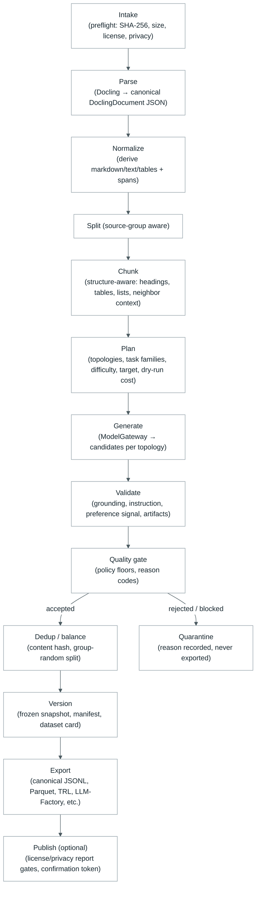

# Architecture — Pipeline Flow Diagram

One picture of the end-to-end pipeline: from intake of a permitted document
through to export and optional publication. Each stage runs inside the durable
job engine, so the whole graph is checkpointable and resumable (see
[jobs.md](jobs.md)).

## Stage notes

- **Intake** treats documents as **untrusted** (§8.6): it preflights the file,
  records SHA-256, byte size, media type, and runs license and privacy
  classification before anything is parsed.
- **Parse** persists the canonical DoclingDocument JSON; markdown/text/tables
  are derived artifacts. A resource guard manages memory and worker recycling.
- **Normalize → Split → Chunk** honor structure: chunks keep tables and lists
  together and carry `source_span_ids`, and splits are grouped by source so a
  document does not cross train/validation boundaries undesirably.
- **Plan** is a dry run — no model calls — and reports the estimated cost and
  expected yield against `budget.maximum_cost_usd`.
- **Generate** emits typed candidates (SFT, preference, KTO, evaluation)
  through the `ModelGateway`.
- **Validate → Quality gate** produce per-dimension scores and reason codes;
  failures route to **Quarantine** with their cause.
- **Dedup/balance** removes content-hash duplicates and balances task-family /
  difficulty proportions, then assigns the grouped-random split.
- **Version** freezes a snapshot with manifest, quality report, dataset card,
  source manifest, license report, and privacy report.
- **Export** writes trainer formats from the one canonical version; the optional
  **publish** path is gated by license/privacy reports and requires a
  confirmation token.

The thin arrows represent durable stage boundaries: output checkpointed per
stage, so a resumed job continues from the last completed stage rather than
repeating earlier work (including already-paid model calls).
