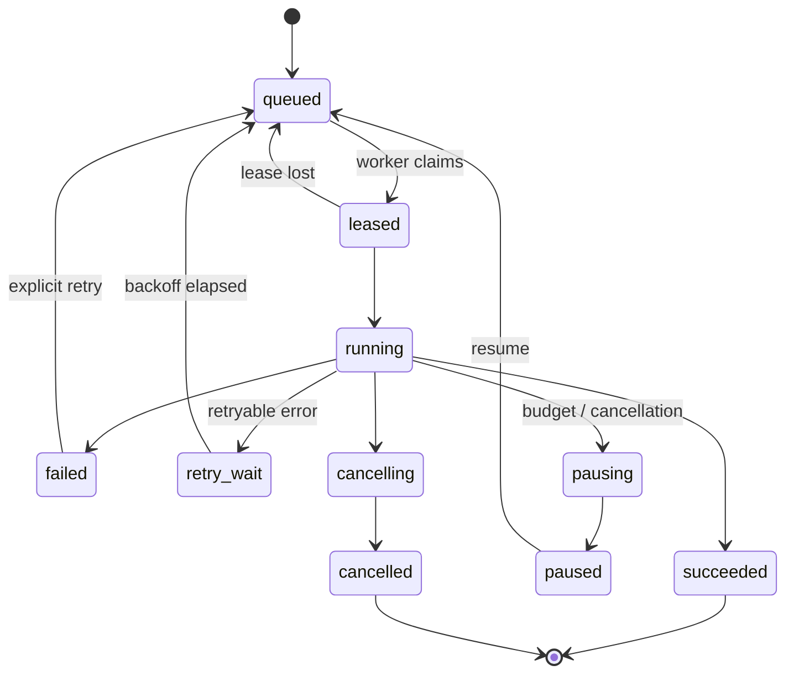

# Architecture — Durable Job Engine

Knovaryn's value depends on long, expensive generation jobs surviving crashes,
disconnects, and budget pressure without silently re-spending money. The job
engine is the subsystem that makes that true.

## Design goals

- **Durability:** every state change and event is persisted; a killed worker
  never loses the job.
- **Idempotency:** the same logical job cannot double-spend provider tokens.
- **Resume:** a restarted job continues from its last completed stage, not from
  the beginning.
- **Budgets are hard limits:** a job pauses *before* exceeding its limits.
- **Cooperative cancellation:** no hard kills mid-write.

## Job lifecycle and state machine



Terminal states are `succeeded`, `failed`, and `cancelled`. Invalid transitions
raise `JobStateError`. A failed job can only return to `queued` via an explicit
retry — never automatically in a loop.

## Stages and checkpoints

A job is a sequence of stages (`intake → parse → chunk → plan → generate →
validate → quality → dedup/balance → version → export`). Each running stage can
write **output checkpoints** (via the `checkpoint_store`) recording which chunks
already produced accepted candidates. On resume, the engine reads the
checkpoint rather than re-running finished work. The engine documentation makes
this contractual:

> every state change is persisted, events recorded, budgets honored, and
> per-stage results checkpointed so a restarted job resumes without repeating
> completed provider calls.

## Leases and heartbeats

Workers **claim** eligible jobs by taking a lease:

- `lease_owner` + `lease_expires_at` mark the claim.
- A worker must refresh its `heartbeat_at` on a cadence shorter than the lease
  so the job is not stolen mid-run.
- If a worker dies, the lease expires and the job returns to `queued` for
  another worker.

`claim_eligible` selects jobs a worker can pick up deterministically, so two
workers do not run the same job.

## Retries (spec §7.4)

Failures are **classified** before retrying:

- **Transient** (timeout, rate-limit, connection): retryable with bounded
  exponential backoff + jitter (`base 1s`, `max 60s`, multiplier `2`, default
  `max_attempts` 3).
- **Provider** errors: retried only if the error is marked retryable.
- **Budget exhausted** (`budget_exhausted`): pause, do not burn more calls.
- **Policy block** (`policy_block`): **never retried** — a deterministic policy
  rejection (PII, blocked license) is not a transient condition.

`max_attempts` (default 3) bounds retries.

## Budgets (spec §7.5)

`BudgetState` carries hard limits: `maximum_cost_usd`, `maximum_calls`,
optional input/output token caps and duration, `maximum_examples`, and
per-provider rate limits. Accumulators track `spent_cost_usd`, `calls_made`,
tokens, and `examples_produced`. Before each provider call the job calls
`budget.check()` — which **raises before** the limit is crossed — and a job must
pause with `budget_exhausted` rather than overspend. Costs are priced from a
**dated, overridable price profile**, never hard-coded in domain logic, and
recorded to a `cost_ledger`.

## Cancellation and pause

Cancellation is **cooperative**: `running → pausing → paused` (or
`running → cancelling → cancelled`) so a stage can flush its checkpoint before
stopping. `cancellation_requested_at` is recorded. A cancelled job is terminal;
a paused job can be resumed back to `queued`.

## Idempotency and resume in practice

```bash
knovaryn run --resume launch-dataset --job <id>   # continue from checkpoint
knovaryn job events --project <p> --job <id> --follow
```

An `idempotency_key` and `input_config_hash` identify the logical job and its
exact resolved configuration, so re-submitting the same work is recognized and
does not duplicate provider calls. `attempt_count` / `max_attempts`, plus
`estimated_cost` / `actual_cost`, keep spend accountable across attempts.

## Failure semantics

- A job that fails records `error_code` and `error_summary` (surfaced by
  `knovaryn job status`) and emits structured `JobEvent`s.
- Events are an append-only sequenced log (`job_events`) available via
  `knovaryn job events`.
- Because checkpoints are atomic and blob-before-manifest, a crash mid-write
  cannot leave a half-committed stage.
