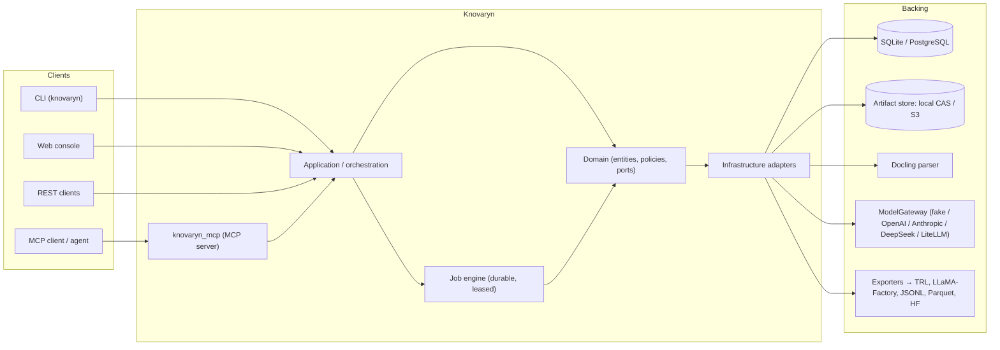

# Architecture — Overview

Knovaryn is built as a **layered hexagon**: a framework-free domain in the
center, ports on its boundary, and interchangeable infrastructure and interface
adapters around it. This keeps MCP, CLI, REST, parsing, storage, and model
providers swappable without leaking their types into domain logic.

## Layers

```
┌─────────────────────────────────────────────────────────────┐
│ Interfaces   CLI  ·  MCP (knovaryn_mcp)  ·  REST  ·  Web     │
├─────────────────────────────────────────────────────────────┤
│ Application  project / source / plan / run / review /       │
│              version / export / publish orchestration        │
├─────────────────────────────────────────────────────────────┤
│ Pipeline     intake → parse → chunk → plan → generate →      │
│              validate → quality → dedup/balance → version →  │
│              export → optional publish                        │
├─────────────────────────────────────────────────────────────┤
│ Domain       entities · schemas · policies · ports           │
│              (Pydantic + pure Python, no framework imports)  │
├─────────────────────────────────────────────────────────────┤
│ Infrastructure  SQLite/Postgres · artifact store · Docling   │
│              · chunking · ModelGateway · exporters · privacy │
└─────────────────────────────────────────────────────────────┘
```

**Dependency rule:** each layer depends only on layers beneath it. The domain
depends on nothing external except Pydantic. Interfaces depend on the
application/pipeline, never reach into infrastructure.

## Ports (spec §5.4)

The domain declares typed `Protocol`s that infrastructure implements. Examples:

- `ArtifactStore` — content-addressed, immutable bytes + manifest; streaming
  puts, checksum verification, atomic commit, repair.
- `ProjectRepository` / `JobRepository` — persistence behind repository ports.
- `DocumentParser` / `Chunker` — parsing and structure-aware chunking.
- `ModelGateway` / `EmbeddingGateway` — normalized LLM completion and
  capability negotiation.
- `Validator` / `Judge` — scoring.
- `PIIScanner` / `LicensePolicy` — privacy and licensing.
- `DatasetExporter` / `Publisher` — trainer formats and publication.
- `EventSink` / `Clock` / `IdGenerator` — cross-cutting.

Concrete adapters (SQLite, S3, Docling, LiteLLM, exporters) implement these
ports and are selected by configuration.

## Context diagram



The `ArtifactStore` supports two backends behind one port: **local CAS**
(default, filesystem under `.knovaryn/artifacts`) and **S3-compatible** (MinIO,
etc.). State rows reference committed artifact hashes; an outbox pattern and
`repair` reconcile orphans.

## See also

- [Pipeline flow diagram](diagram.md)
- [Durable job engine](jobs.md)
- [Security architecture](security.md)
- [Config reference](../reference/config.md) for selecting profiles and backends
