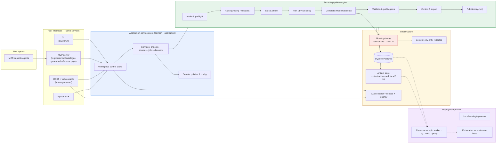
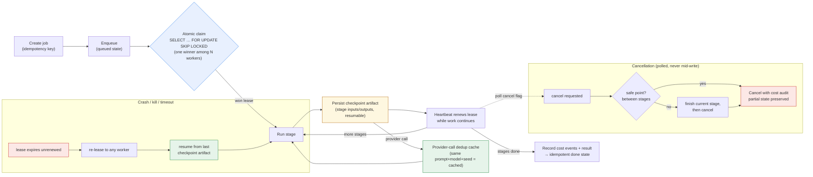
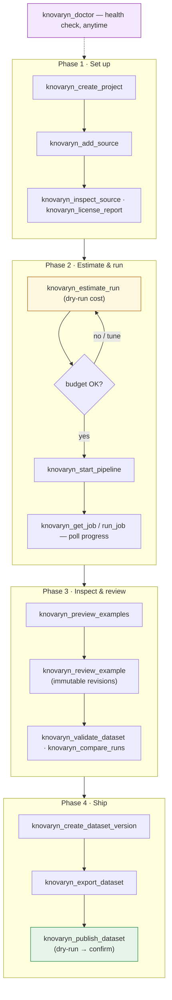
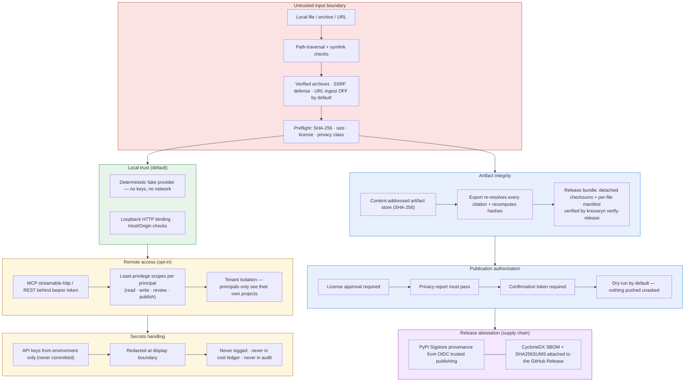
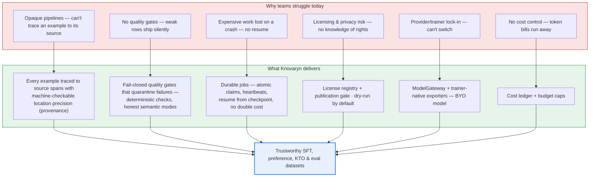

# Architecture — at a Glance (Diagrams)

This page collects the diagrams that used to live in the README, so the README
stays concise and these stay editable in one place. Each is available as a
rendered PNG (`assets/*.png`) and as raw Mermaid source
(`assets/diagrams/*.mmd`); the inline blocks below mirror those sources.
Diagram text is count-free by policy — surfaces say what they are, never how
many; the generated reference pages carry live numbers.

## 1. System architecture — one core, four interfaces

Everything sits on a single **application-services core** (domain + application)
behind a durable pipeline engine. Four interfaces — CLI, MCP server, REST + web
console, and the Python SDK — all drive the *same* services, so a job started
from the CLI is visible everywhere.

  

## 2. End-to-end pipeline flow — every example traced to its source

```mermaid
flowchart LR
    subgraph INPUT["1 · Intake — permitted documents"]
        direction TB
        A1["Local files"] --> A2["Path + symlink checks"]
        A3["Archives zip / tar"] --> A2
        A4["URLs — opt-in"] --> A2
        A2 --> A5["Preflight: SHA-256 · size · pages · license"]
    end

    subgraph PARSE["2 · Parse → canonical representation"]
        direction TB
        P1["Docling canonical JSON"] --> P2["Diagnostics + quality summary"]
        P2 --> P3["Markdown — derivative output"]
    end

    subgraph SPLIT["3 · Split + chunk with provenance"]
        direction TB
        S1["Split at source group"] --> S2["Structure-aware chunking"]
        S2 --> S3["Heading paths · spans · source_span_ids · sha256<br/>location precision recorded per span"]
    end

    subgraph GEN["4 · Generate examples (durable stage)"]
        direction TB
        G1["Planner: task + difficulty map<br/>budget · profile · target-size constraints"] --> G2["Prompt library"]
        G2 --> G3["SFT · Preference · KTO · Eval"]
        G3 --> G4["Model gateway — fake offline or LiteLLM"]
        G4 --> G5["Provider-call cache<br/>(idempotent retries, no double cost)"]
    end

    subgraph VAL["5 · Validate — gates quarantine failures"]
        direction TB
        V1["Schema / Grounding / Completeness"]
        V2["Format / Refusal / Dedupe"]
        V3["Contamination / Privacy / License"]
        V4a["Semantic consistency<br/>offline-fast deterministic · certified-semantic judge"]
        V4b["Preference signal (pairs)<br/>+ information gain"]
        V1 --> V5{"All gates pass?"}
        V2 --> V5
        V3 --> V5
        V4a --> V5
        V4b --> V5
        V5 -- fail --> V6["Quarantine / review routing"]
        V5 -- pass --> V7["Review state"]
    end

    subgraph OUT["6 · Version + export + publish"]
        direction TB
        O1["Dataset version (immutable)"] --> O2["Release bundle: card · manifest · reports · checksums"]
        O2 --> O3["Exporters — provenance gate re-resolves every citation"]
        O2 --> O4["Publish to Hugging Face — dry-run by default"]
    end

    A5 --> P1
    P3 --> S1
    S3 --> G1
    G5 --> V1
    V7 --> O1

    style V6 fill:#fbe3e3,stroke:#b3261e
    style A5 fill:#e8f0fe,stroke:#1a73e8
    style O4 fill:#e8f0fe,stroke:#1a73e8
    style V4a fill:#fef7e0,stroke:#b06000
    style V4b fill:#fef7e0,stroke:#b06000
    style G5 fill:#e6f4ea,stroke:#188038
```

  

## 3. Durable jobs — nothing is lost on a crash

Every stage of the pipeline runs as a **durable job** with atomic claims,
heartbeats, idempotency keys, checkpoint artifacts, and budget caps. A crash,
kill, or timeout just expires the lease and **resumes from the last checkpoint**
— no re-generation of paid work.

  

## 4. A typical MCP agent session

From an empty workspace to an exported dataset version over the MCP tools —
exactly what a Claude/Cursor-style agent sees.

  

## 5. Security & privacy flow

Offline-first, secrets from the environment only, tenant-scoped remote access,
and nothing published unless explicitly approved.

  

## 6. Why it's useful — problem → value

  

