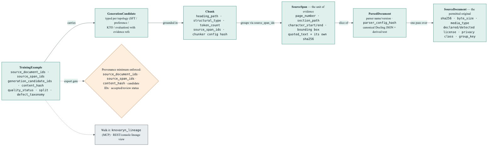
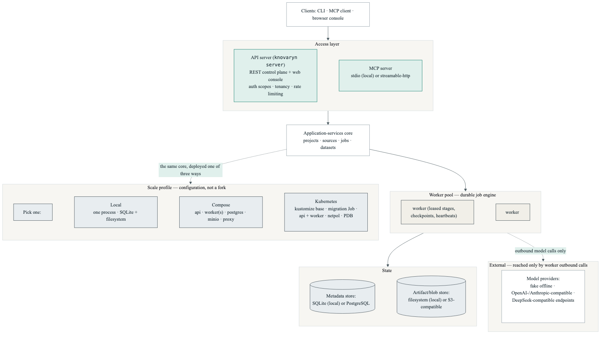
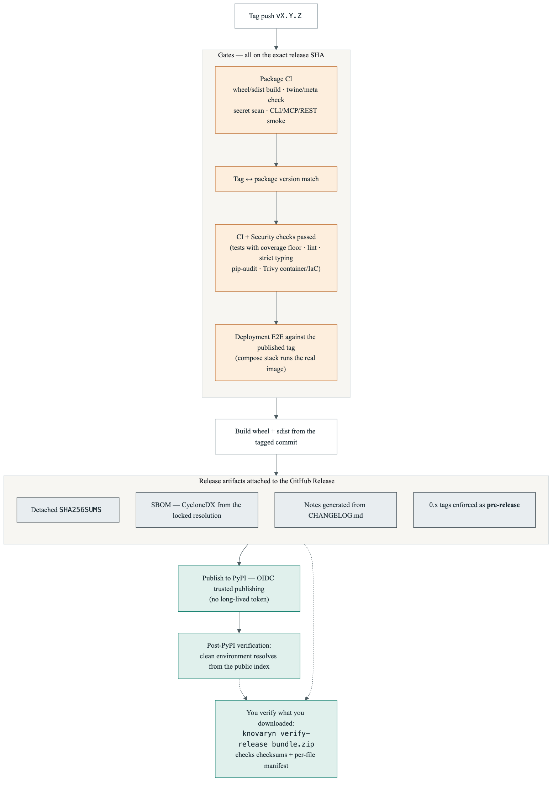

# Architecture — Diagram Gallery

Every Knovaryn diagram has a Mermaid source file in the repo — most under
[`assets/diagrams/`](https://github.com/waalwalker1/knovaryn/tree/main/docs/assets/diagrams),
the README pipeline diagram at [`assets/pipeline-flow.mmd`](https://github.com/waalwalker1/knovaryn/blob/main/docs/assets/pipeline-flow.mmd) —
and a deterministic PNG render beside it (`assets/*.png`), produced by
`python scripts/render_diagrams.py`. This page embeds those renders with short
commentary; for side-by-side browsing with keyboard-switchable views, use the
[architecture explorer](explorer.md).

The source files are canonical — this page never re-states their contents
inline, so the prose and the picture cannot drift apart. All diagrams share
the [design-system palette](../design-system/color.md) and are count-free by
policy: they say what things are, never how many; the generated reference
pages carry live numbers.

## 1. System architecture — one core, many interfaces

Six layers, top to bottom: the people and agents, the four interfaces (CLI,
MCP server, REST + web console, Python SDK), the application-services core,
the durable pipeline engine with its eight checkpointed stages, the
infrastructure (metadata store, content-addressed artifacts, model gateway),
and the three deployment profiles. The layering is the point: every interface
drives the *same* core, so a job started from the CLI is visible everywhere.

{: width="100%" }

[Mermaid source](https://github.com/waalwalker1/knovaryn/blob/main/docs/assets/diagrams/system-architecture.mmd) · [Full-size PNG](../assets/system-architecture.png)

## 2. End-to-end pipeline flow — every example traced to its source

Two rows. **Prepare** moves a permitted document to a generation plan:
intake preflight (SHA-256, size, license, privacy), parsing to canonical
JSON, structure-aware splitting that records `source_span_ids`, and a dry-run
plan that prices the run before any model call. **Produce** executes it:
generation through the model gateway, validation where failures quarantine
with reason codes (and are never exported), human review with immutable
revisions, and versioning/export where citations are re-resolved and
checksums written.

{: width="100%" }

[Mermaid source](https://github.com/waalwalker1/knovaryn/blob/main/docs/assets/pipeline-flow.mmd) · [Full-size PNG](../assets/pipeline-flow.png)

## 3. Durable jobs — nothing is lost on a crash

Three lanes. Normal execution claims a job atomically (`SKIP LOCKED`, one
winner among N workers), checkpoints after every stage, and heartbeats while
it works. The crash lane is what a killed worker triggers: the lease expires
unrenewed, any replacement worker re-leases, and the job resumes from the
last checkpoint — provider-call dedup means completed paid work is never
repeated. The cancellation lane is cooperative: the cancel flag is polled
between stages, never mid-write, and cancellation records a cost audit.

{: width="100%" }

[Mermaid source](https://github.com/waalwalker1/knovaryn/blob/main/docs/assets/diagrams/durable-jobs.mmd) · [Full-size PNG](../assets/durable-jobs.png)

## 4. A typical MCP agent session

Four phases left to right — setup, estimate & generate, inspect & review,
version & release — each naming the real MCP tools an agent calls. The
estimate step is a deliberate loop: a dry-run cost estimate is compared
against the budget *before* `start_pipeline`, and a plan that overshoots goes
back for tuning. `knovaryn_doctor` sits outside the phases because it is
useful at any point. The full tool catalogue lives on the
[MCP tools reference](../reference/mcp-tools.md), never in one crowded image.

{: width="100%" }

[Mermaid source](https://github.com/waalwalker1/knovaryn/blob/main/docs/assets/diagrams/mcp-session.mmd) · [Full-size PNG](../assets/mcp-session.png)

## 5. Provenance chain — from exported row back to source bytes

Read right to left for the storage direction, left to right for the audit
direction: an exported training example carries generation-candidate and
content-hash identity; it is grounded in source spans that record page,
section path, character offsets, bounding box when available, and the quoted
text with its own SHA-256; spans slice parsed documents, and parsed documents
record which parser configuration produced them; source documents carry the
file hash, license, and privacy classification that intake admitted. The
diamond is the policy: a provenance minimum is enforced, and
`knovaryn_lineage` walks the whole chain for any example.

{: width="100%" }

[Mermaid source](https://github.com/waalwalker1/knovaryn/blob/main/docs/assets/provenance-lineage.mmd) · [Full-size PNG](../assets/provenance-lineage.png)

## 6. Security & privacy boundaries

The map is color-coded by trust: the red region is untrusted input, where
path-traversal and symlink checks, verified archives, SSRF defense, and
URL-ingest-off-by-default run before preflight records hash, size, license,
and privacy class. Green is the local default — the deterministic fake
provider needs no keys and no network, and servers bind to loopback with
Host/Origin checks. Amber is opt-in remote access (bearer token,
least-privilege scopes, tenant isolation) and secrets handling (environment
only, redacted at the display boundary, never logged). The slate regions are
artifact integrity, publication authorization, and the release attestation
chain.

{: width="100%" }

[Mermaid source](https://github.com/waalwalker1/knovaryn/blob/main/docs/assets/diagrams/security.mmd) · [Full-size PNG](../assets/security.png)

## 7. Deployment topology — same core at three scales

One column is the running system: clients, the access layer (API + MCP
server), the application-services core, the worker pool, and the state
stores. Model providers sit outside the trust boundary — only workers make
outbound calls to them. The bottom row is the scale decision: local single
process, compose stack, or Kubernetes — configuration, not a fork.

{: width="100%" }

[Mermaid source](https://github.com/waalwalker1/knovaryn/blob/main/docs/assets/deployment-topology.mmd) · [Full-size PNG](../assets/deployment-topology.png)

## 8. Release supply chain — from tag to verified install

Mirrors `.github/workflows/publish.yml`: a tag push triggers gates that all
run on the exact release SHA (package CI, tag↔version match, CI + security
checks, deployment E2E against the published tag), then build, artifact
attachment (detached SHA256SUMS, CycloneDX SBOM, changelog notes, 0.x
prerelease enforcement), OIDC trusted publishing to PyPI, post-publish
verification from a clean environment — and finally your own
`knovaryn verify-release` on the bundle you downloaded.

{: width="100%" }

[Mermaid source](https://github.com/waalwalker1/knovaryn/blob/main/docs/assets/release-supply-chain.mmd) · [Full-size PNG](../assets/release-supply-chain.png)

## 9. Why it's useful — problem → value

Six problems teams hit with ad-hoc synthetic-data pipelines, each paired with
the mechanism Knovaryn ships instead, converging on the actual product:
trustworthy SFT, preference, KTO, and evaluation datasets.

{: width="100%" }

[Mermaid source](https://github.com/waalwalker1/knovaryn/blob/main/docs/assets/diagrams/value-proposition.mmd) · [Full-size PNG](../assets/value-proposition.png)

## Regenerating

```bash
python scripts/render_diagrams.py
```

renders every source in `docs/assets/diagrams/` (plus
`docs/assets/pipeline-flow.mmd`) to PNG with the pinned mermaid CLI. The
render is deterministic for a given source and toolchain; commit sources and
renders together.
