# Architecture — at a Glance (Diagrams)

This page collects the diagrams that used to live in the README, so the README
stays concise and these stay editable in one place. Each is available as a
rendered PNG (`assets/*.png`) and as raw Mermaid source
(`assets/diagrams/*.mmd`).

## 1. System architecture — one core, four interfaces

Everything sits on a single **application-services core** (domain + application)
behind a durable pipeline engine. Four interfaces — CLI, the 23-tool MCP server,
REST + web console, and the Python SDK — all drive the *same* services, so a job
started from the CLI is visible everywhere.

  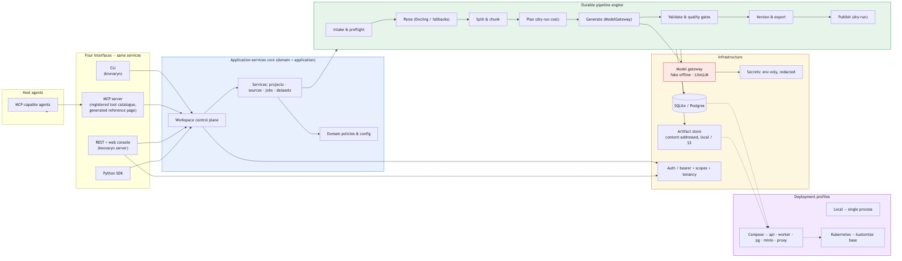

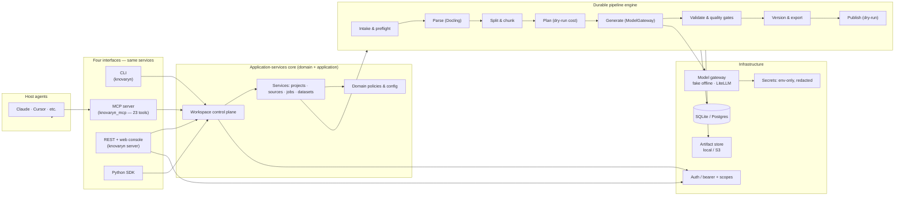

## 2. End-to-end pipeline flow — every example traced to its source

  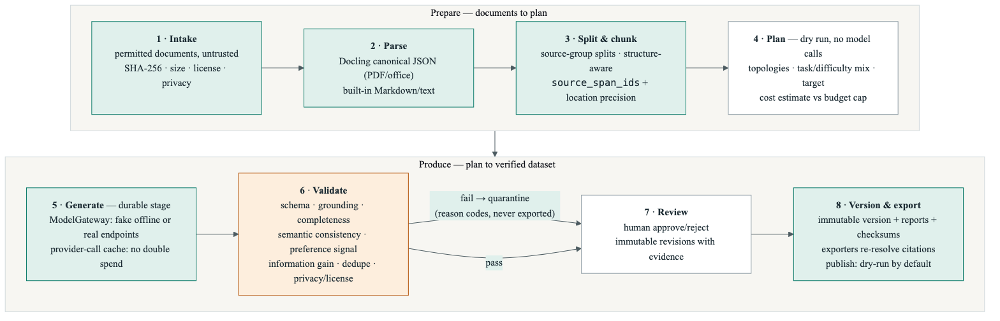

```mermaid
flowchart LR
    subgraph INPUT["1 · Intake — permitted documents"]
        direction TB
        A1["Local files"] --> A2["Path + symlink checks"]
        A3["Archives zip / tar"] --> A2
        A4["URLs — opt-in"] --> A2
        A2 --> A5["Preflight: SHA-256 · size · pages · license"]
    end

    subgraph PARSE["2 · Parse → canonical representation"]
        direction TB
        P1["Docling canonical JSON"] --> P2["Diagnostics + quality summary"]
        P2 --> P3["Markdown — derivative output"]
    end

    subgraph SPLIT["3 · Split + chunk with provenance"]
        direction TB
        S1["Split at source group"] --> S2["Structure-aware chunking"]
        S2 --> S3["Heading paths · spans · source_span_ids · sha256"]
    end

    subgraph GEN["4 · Generate examples"]
        direction TB
        G1["Planner: task + difficulty map"] --> G2["Prompt library"]
        G2 --> G3["SFT · Preference · KTO · Eval"]
        G3 --> G4["Model gateway — fake offline or LiteLLM"]
    end

    subgraph VAL["5 · Validate — gates quarantine failures"]
        direction TB
        V1["Schema / Grounding / Completeness"]
        V2["Format / Refusal / Dedupe"]
        V3["Contamination / Privacy / License"]
        V1 --> V4{"All gates pass?"}
        V2 --> V4
        V3 --> V4
        V4 -- fail --> V5["Quarantine"]
        V4 -- pass --> V6["Review state"]
    end

    subgraph OUT["6 · Version + export + publish"]
        direction TB
        O1["Dataset version"] --> O2["Release bundle: card · manifest · reports · checksums"]
        O2 --> O3["Exporters — JSONL + variations"]
        O2 --> O4["Publish to Hugging Face — dry-run by default"]
    end

    A5 --> P1
    P3 --> S1
    S3 --> G1
    G4 --> V1
    V6 --> O1
```

## 3. Durable jobs — nothing is lost on a crash

Every stage of the pipeline runs as a **durable job** with leases, heartbeats,
idempotency keys, checkpoints, and budget caps. A crash, kill, or timeout just
expires the lease and **resumes from the last checkpoint** — no re-generation of
paid work.

  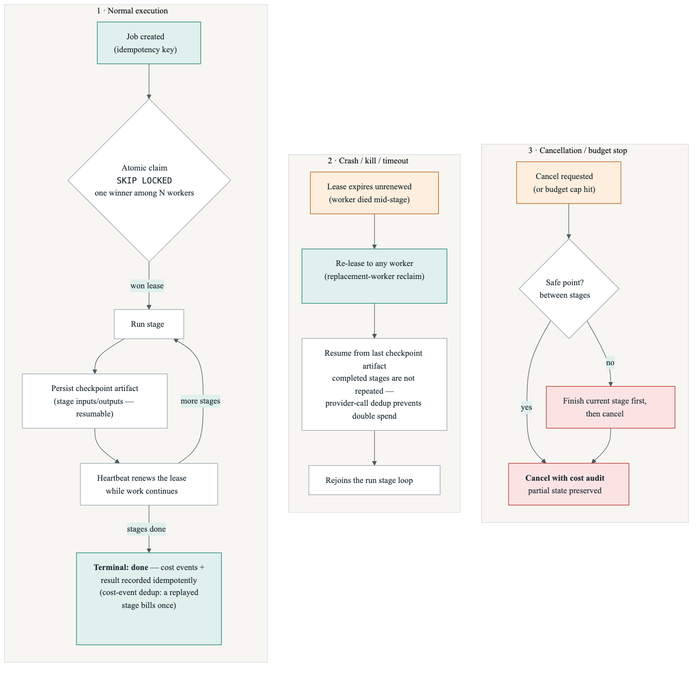

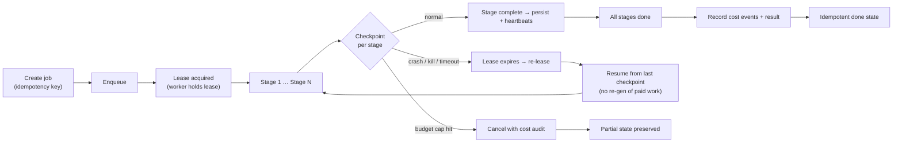

## 4. A typical MCP agent session

From an empty workspace to a published dataset version using the 23-tool MCP
suite — exactly what a Claude/Cursor-style agent sees.

  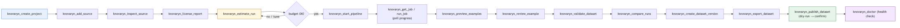

```mermaid
flowchart LR
    A["knovaryn_create_project"] --> B["knovaryn_add_source"]
    B --> C["knovaryn_inspect_source"]
    C --> D["knovaryn_license_report"]
    D --> E["knovaryn_estimate_run"]
    E --> F{"budget OK?"}
    F -->|"yes"| G["knovaryn_start_pipeline"]
    F -->|"no / tune"| E
    G --> H["knovaryn_get_job / run_job<br/>(poll progress)"]
    H --> I["knovaryn_preview_examples"]
    I --> J["knovaryn_review_example"]
    J --> K["knovaryn_validate_dataset"]
    K --> L["knovaryn_compare_runs"]
    L --> M["knovaryn_create_dataset_version"]
    M --> N["knovaryn_export_dataset"]
    N --> O["knovaryn_publish_dataset<br/>(dry-run → confirm)"]
    O --> P["knovaryn_doctor (health check)"]
```

## 5. Security & privacy flow

Offline-first, secrets from the environment only, and nothing published unless
explicitly approved.

  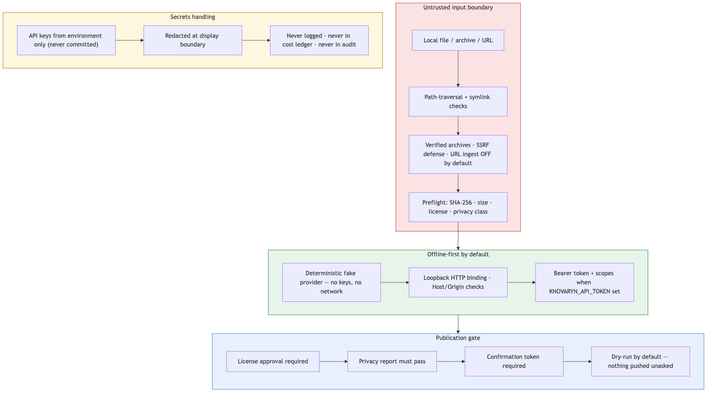

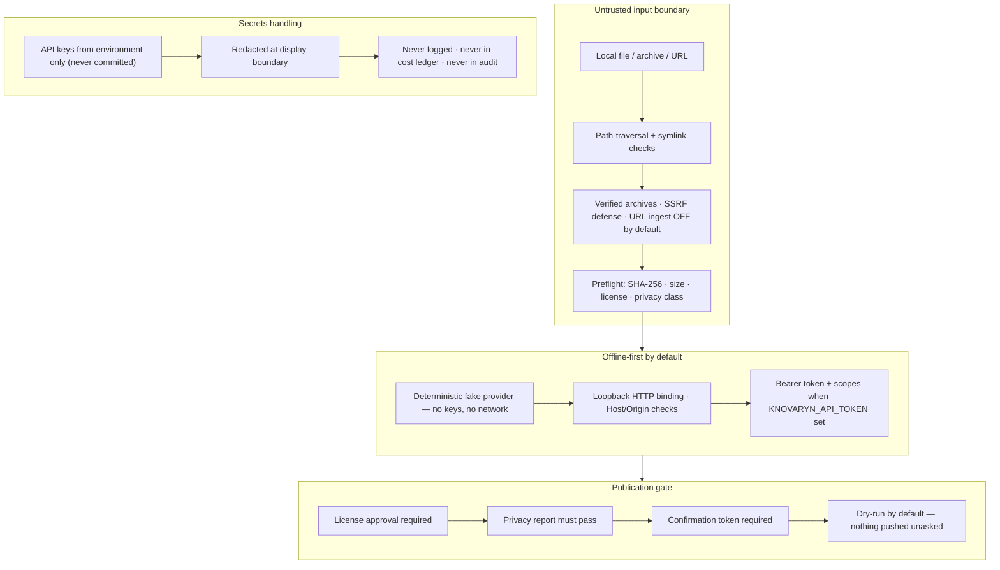

## 6. Why it's useful — problem → value

  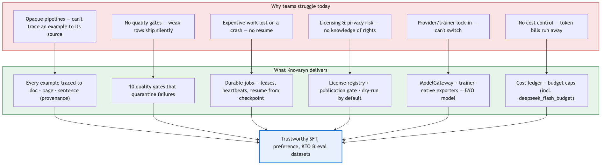

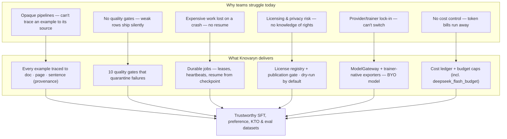
