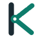

# Brand foundations

Knovaryn is an **open-source, self-hosted, MCP-native training-data foundry**.
The identity expresses the product's core promise:

> **Every training example, traced to its source.**

## Identity attributes

| Attribute | What it means visually |
|---|---|
| **Traceable** | Provenance routes are drawn as segmented evidence spans converging on a destination — never as vague arrows |
| **Rigorous** | Quality gates are literal: a ring nothing passes through by accident; verified output is a solid, continuous stroke |
| **Engineered** | Monoline geometry, fixed grids, no gradients inside marks; the visual language feels machined, not painted |
| **Open** | Generous whitespace, readable defaults, dark- and light-scheme parity; nothing hides behind decoration |

## The symbol — Tracemark

The Knovaryn K is a provenance route:

- the **stem** is the source document — the fixed spine of truth;
- the **arm** is three segmented evidence spans converging inward;
- the **gate ring** at the junction is the quality gate;
- the **leg** is the verified example — one solid stroke leaving the gate.

The wordmark's K uses the same construction. Symbol and name are one idea.

{ loading=lazy }

Full construction rules, clear space, minimum sizes, variants and misuse
examples live in [the brand guidelines](https://github.com/waalwalker1/knovaryn/blob/main/docs/assets/brand/brand-guidelines.md).

## Voice

- Say what the thing does, then why it matters. Short declaratives.
- Numbers only from committed evidence (benchmarks, tests) — with their
  context labels.
- Honest maturity language: `alpha`, `experimental`, `not measured` are
  first-class words ([components](components.md#maturity-labels)).
- No hype adjectives ("revolutionary", "game-changing"), no invented
  social proof.

## Reproduction

Every asset in `docs/assets/brand/` is generated by
`scripts/visuals/build_brand_assets.py` from a single geometry source.
To change the identity, change the generator and rerun it — never hand-edit
outputs. The wordmark is original vector geometry: no font dependency, no
font license attached to the mark.
