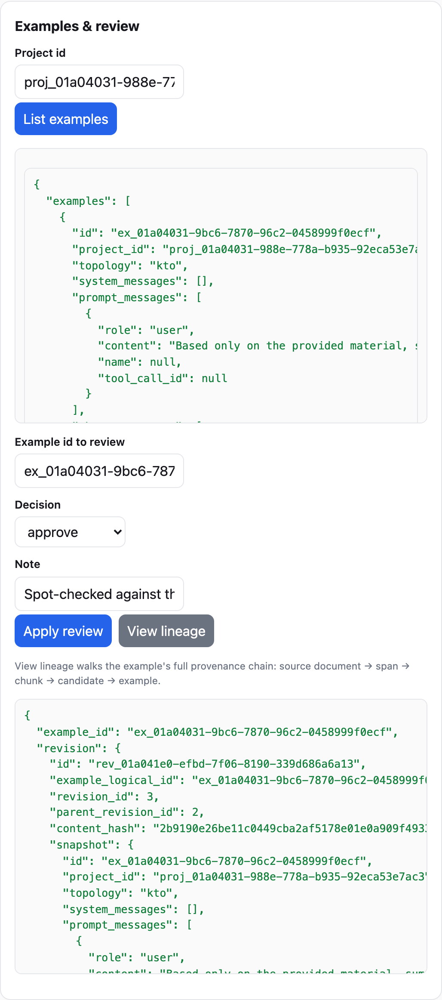
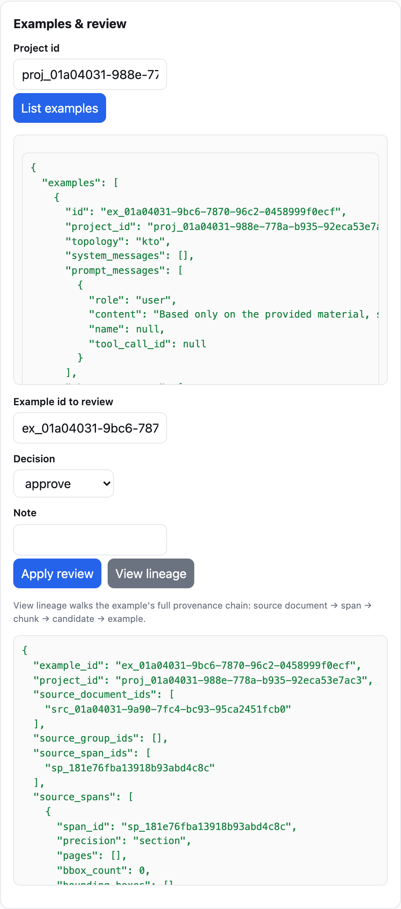

# Guides — Your First Real Project

The quickstart runs on the deterministic fake provider. This guide walks a
**real** project: real permitted documents, a **local model provider**, and the
full review/version/export loop. It assumes a local OpenAI-compatible endpoint
(such as Ollama or a local vLLM) is running on `http://127.0.0.1:8080/v1`.

> The same flow works with a hosted provider; a local one just keeps keys
> off the machine and makes cost introspection concrete.

## 1. Configure the provider via environment

Providers are wired through configuration and environment (prefix `KNOVARYN_`).
Point the gateway at your local endpoint:

```bash
export KNOVARYN_DEEPSEEK_BASE_URL="http://127.0.0.1:8080/v1"   # OpenAI-compatible
export KNOVARYN_GENERATOR_MODEL="your-gen-model"
export KNOVARYN_CRITIC_MODEL="your-critic-model"
export KNOVARYN_VERIFIER_MODEL="your-verifier-model"
```

Because `models.*` default to `${KNOVARYN_...}` placeholders, setting these env
vars is enough. Check the wiring:

```bash
uv run knovaryn doctor
```

## 2. Create the project

```bash
uv run knovaryn project create support-config \
  --name "Support-Config Dataset" \
  --description "SFT + preference from internal runbooks (company-permitted)"
```

Use the printed project handle (`proj_…`) below as `<proj_handle>`.

## 3. Add documents with declared licenses

Add each file you are permitted to use, declaring the license:

```bash
uv run knovaryn source add <proj_handle> ./docs/runbook-a.pdf --license internal --privacy internal
uv run knovaryn source add <proj_handle> ./docs/runbook-b.md  --license internal --privacy internal
uv run knovaryn source list <proj_handle>
```

`source list` shows the ingested sources with their preflight: SHA-256, size,
license status, privacy classification. If a license is `blocked` or
`unknown`, content is gated from public export but (per policy) can still be
used for a non-public path.

## 4. Estimate before you spend

The dry-run **cost estimate** is exposed over MCP (`knovaryn_estimate_run`)
and REST before anything is generated. On the CLI, go straight to `run` and
set a hard spend cap:

```bash
uv run knovaryn run \
  --project <proj_handle> \
  --target 800 \
  --budget-usd 50
```

Generation is now real and billable (tokens against a live model); keep
`budget.maximum_cost_usd` (default `50.0` in `domain/config.py`) aligned with
your intent.

## 5. Watch progress

```bash
uv run knovaryn job list --project <proj_handle>
uv run knovaryn job status <job_handle>
```

Jobs are durable: leases, heartbeats, checkpoints, idempotency keys, and a
provider-call dedup cache. Interrupting a run and retrying resumes from the
persisted checkpoint instead of redoing paid work; actual versus estimated
cost is recorded per job so spend stays auditable.

## 6. Review with evidence

Example handles (`ex_…`) appear in validation output and in the REST/MCP
listings. Record decisions as immutable revisions:

```bash
uv run knovaryn review <ex_handle> approve --reviewer alice --note "grounded"
uv run knovaryn review <ex_handle> reject --reviewer alice \
  --note "grounding<0.9" 
```

Examples that failed policy already landed in quarantine with reason codes and
are excluded from export. Human review refines the remainder; every decision
is recorded as a new revision — nothing is mutated in place.


*The same review applied from the console: a new immutable revision (2, parent 1) records the decision.*

## 7. Version and export

```bash
uv run knovaryn dataset validate <proj_handle>
uv run knovaryn dataset version <proj_handle> --set 1.0.0
uv run knovaryn dataset export <proj_handle> \
  --version <ver_handle> --format trl_sft --out ./export/sft
uv run knovaryn dataset export <proj_handle> \
  --version <ver_handle> --format parquet --out ./export/parquet
```

`dataset validate` re-checks provenance minimums and quality gates before
versioning; format ids are the generated table in the
[exporter reference](../reference/exporters.md).

## 8. Inspect lineage

Lineage is served over REST
(`GET /v1/projects/{id}/examples/{eid}/lineage`) and MCP (`knovaryn_lineage`),
returning the full walk example → generation candidate → chunk → parsed
document → source document, with each span's machine-reported location
precision. The exported release bundle includes the dataset card, manifest,
and reports.


*The same lineage in the web console (§6–8 of this guide, driven through the browser).*

## Notes and honesty

- Quality scores are relative to your configured policy and corpus. A row that
  passes is not a guarantee it improves your model.
- The local endpoint must actually accept the OpenAI-compatible chat schema;
  `knovaryn doctor` surface-tests wiring but not model quality.
- Real runs bill against your provider; keep the budget cap set.
