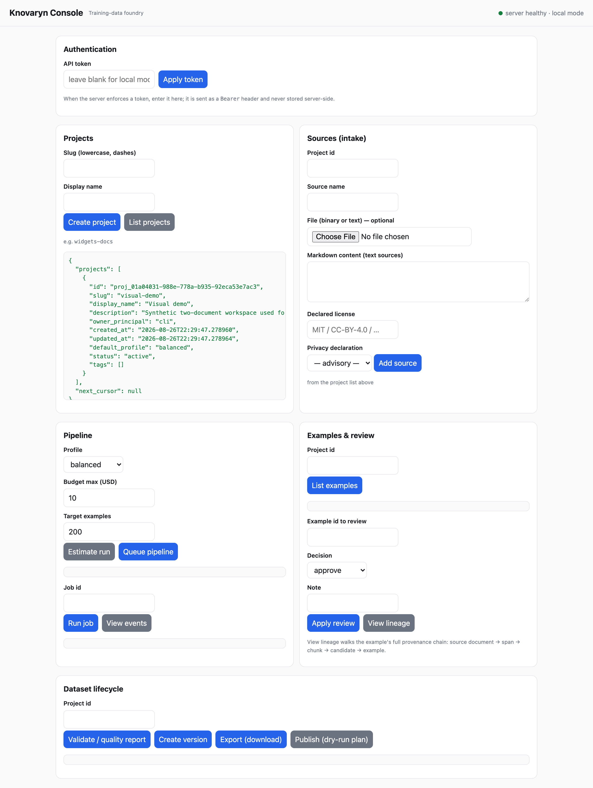

# Guides — pick your path

Eight common jobs, one foundry. Select yours: every card below states who it
is for, the minimal command, what you get, and the limitation you should know
before you start. Tabs work from the keyboard (arrow keys) and without
JavaScript.

<input type="radio" name="kn-usecase" id="kn-uc-0" checked><label for="kn-uc-0">PDF → SFT</label>
<input type="radio" name="kn-usecase" id="kn-uc-1"><label for="kn-uc-1">Preference / DPO</label>
<input type="radio" name="kn-usecase" id="kn-uc-2"><label for="kn-uc-2">KTO</label>
<input type="radio" name="kn-usecase" id="kn-uc-3"><label for="kn-uc-3">Grounded eval set</label>
<input type="radio" name="kn-usecase" id="kn-uc-4"><label for="kn-uc-4">MCP agents</label>
<input type="radio" name="kn-usecase" id="kn-uc-5"><label for="kn-uc-5">Fully offline</label>
<input type="radio" name="kn-usecase" id="kn-uc-6"><label for="kn-uc-6">Team deployment</label>
<input type="radio" name="kn-usecase" id="kn-uc-7"><label for="kn-uc-7">Hugging Face</label>

<section class="kn-panel">
  
<strong>Who it's for:</strong> ML engineers turning permitted PDFs — handbooks, manuals, papers — into supervised fine-tuning data.

  <pre><code>knovaryn run --project proj_… \
  --family factual_explanation:1.0 --target 200
knovaryn dataset export proj_… --format openai_chat</code></pre>
  
<strong>Expected result:</strong> an SFT dataset (JSONL, Parquet, TRL, OpenAI chat…) whose every accepted example carries evidence references back to source spans — Docling-parsed PDFs yield <code>exact_page</code>/<code>exact_bbox</code> precision.

  
<strong>Limitation:</strong> PDF parsing uses the optional <code>docling</code> extra; scanned documents depend on OCR quality.

  
<a href="pdf-to-sft-dataset/" class="kn-btn kn-btn--secondary">Full guide →</a>

</section>

<section class="kn-panel">
  
<strong>Who it's for:</strong> alignment practitioners building DPO datasets where the <em>rejected</em> response is meaningfully wrong, not trivially separable.

  <pre><code># start a pipeline with a preference topology, then:
knovaryn dataset export proj_… --format trl_preference</code></pre>
  
<strong>Expected result:</strong> <code>(prompt, chosen, rejected)</code> triples grounded in permitted sources, rejected responses produced with a controlled negative strategy and their defect recorded — so pairs teach something and stay auditable.

  
<strong>Limitation:</strong> defect labels make review efficient; they don't remove the need to spot-check pairs yourself.

  
<a href="build-dpo-preference-data/" class="kn-btn kn-btn--secondary">Full guide →</a>

</section>

<section class="kn-panel">
  
<strong>Who it's for:</strong> teams using KTO's simpler signal — desirable/undesirable labels instead of paired responses.

  <pre><code>knovaryn dataset export proj_… --format kto</code></pre>
  
<strong>Expected result:</strong> a KTO-format export from the same canonical, provenance-linked dataset version you would ship anywhere else — same gates, same evidence chain.

  
<strong>Limitation:</strong> KTO wants a sensible desirable/undesirable balance; the balancer helps, but policy thresholds are yours to choose.

  
<a href="../concepts/preference-data/" class="kn-btn kn-btn--secondary">Preference-data guidance →</a>

</section>

<section class="kn-panel">
  
<strong>Who it's for:</strong> evaluation leads building QA sets where every answer must be supported by persisted evidence.

  <pre><code># start a pipeline with an evaluation (grounded QA) topology, then:
knovaryn dataset export proj_… --format evaluation</code></pre>
  
<strong>Expected result:</strong> question/answer examples that only export if the answer resolves through lineage to evidence in a permitted source document; ungrounded rows are quarantined with reason codes.

  
<strong>Limitation:</strong> coverage follows your sources — questions can only be as good as the corpus behind them.

  
<a href="grounded-qa-dataset-from-documents/" class="kn-btn kn-btn--secondary">Full guide →</a>

</section>

<section class="kn-panel">
  
<strong>Who it's for:</strong> agent developers who want dataset tooling callable from Claude Desktop, an IDE agent, or any MCP client.

  <pre><code>knovaryn mcp          # stdio transport for local clients
knovaryn mcp --transport streamable-http --port 8080</code></pre>
  
<strong>Expected result:</strong> the full tool catalogue — projects, sources, estimates, pipelines, lineage walks, reviews, versions, exports — driven conversationally; compatibility tested against MCP SDK 1.x and 2.x (<a href="../adr/0007-dual-major-mcp-sdk-compatibility/">ADR-0007</a>).

  
<strong>Limitation:</strong> the server binds locally by default; exposing it beyond localhost requires the hardening checklist.

  
<a href="mcp-clients/" class="kn-btn kn-btn--secondary">Full guide →</a>

</section>

<section class="kn-panel">
  
<strong>Who it's for:</strong> anyone with privacy constraints, an air-gapped machine, or just no provider account yet.

  <pre><code>pip install knovaryn
knovaryn demo --examples 20 --json</code></pre>
  
<strong>Expected result:</strong> the entire loop — ingest, parse, generate, gate, version, export — on bundled samples via the deterministic fake provider. No API keys, no network, byte-for-byte reproducible.

  
<strong>Limitation:</strong> fake-provider output proves plumbing, not training signal; real datasets need a real endpoint.

  
<a href="quickstart/" class="kn-btn kn-btn--secondary">Ten-minute quickstart →</a>

</section>

<section class="kn-panel">
  
<strong>Who it's for:</strong> platform/data teams running one shared Knovaryn instance for many contributors.

  <pre><code>docker compose -f deploy/compose/compose.prod.yaml up</code></pre>
  
<strong>Expected result:</strong> PostgreSQL + S3-compatible storage behind the API, worker pool, and web console — with authentication scopes, tenancy, and per-principal rate limiting; the same application core as single-machine mode.

  
<strong>Limitation:</strong> you operate it: backups, upgrades, and secrets are your responsibility (restore is tested — see the backup runbook).

  
<a href="../deployment/profiles/" class="kn-btn kn-btn--secondary">Deployment profiles →</a>

</section>

<section class="kn-panel">
  
<strong>Who it's for:</strong> anyone who wants to drive the loop from a browser — no CLI required.

  <pre><code>knovaryn server    # http://127.0.0.1:8080 — local-only by default</code></pre>
  
<strong>Expected result:</strong> the local web console: create projects and sources, queue pipelines, read quality reports, apply reviews, and export — every button calling the same REST control plane the CLI uses. The header's health/auth status is always visible, the layout reflows to a single column on phones, and the theme follows your system's light/dark preference.

  
<strong>Limitation:</strong> the console is a local operator surface; it binds to loopback unless you follow the hardening checklist.

  
<a href="quickstart/#what-you-just-did" class="kn-btn kn-btn--secondary">See it in the quickstart →</a>

  
</section>

<section class="kn-panel">
  
<strong>Who it's for:</strong> teams publishing curated datasets to the Hugging Face Hub with provenance intact.

  <pre><code>pip install "knovaryn[hub]"
knovaryn dataset publish proj_… org/dataset-name    # dry-run by default</code></pre>
  
<strong>Expected result:</strong> a Hub-friendly export of the frozen version plus a staged publish with dataset card and provenance — nothing reaches the Hub unless you explicitly authorize it.

  
<strong>Limitation:</strong> the license report that gates publication records rights; it is not legal clearance.

  
<a href="hugging-face-export/" class="kn-btn kn-btn--secondary">Full guide →</a>

</section>

## All guides

| Guide | What it covers |
|---|---|
| [Quickstart](quickstart.md) | Full offline loop in ~10 minutes, no API keys |
| [First real project](first-real-project.md) | A real provider, budgets, and a production-shaped run |
| [PDF to SFT dataset](pdf-to-sft-dataset.md) | Permitted PDFs → gated instruction data |
| [Build DPO preference data](build-dpo-preference-data.md) | Grounded, controlled-negative preference pairs |
| [Grounded QA datasets](grounded-qa-dataset-from-documents.md) | Evidence-backed evaluation data |
| [MCP clients](mcp-clients.md) | Drive everything from an MCP client |
| [MCP training-data server](mcp-training-data-server.md) | Serving datasets to training agents over MCP |
| [Hugging Face export](hugging-face-export.md) | Hub layout + dry-run-by-default publish |
