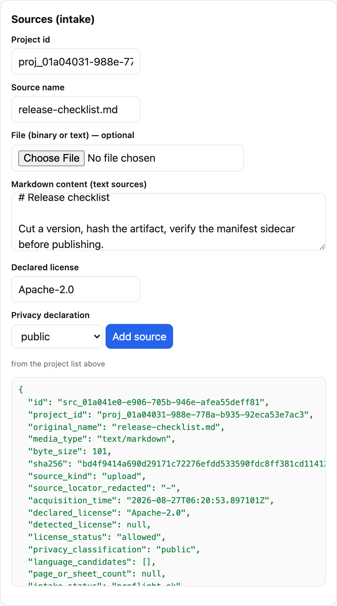
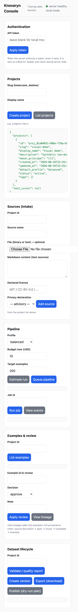
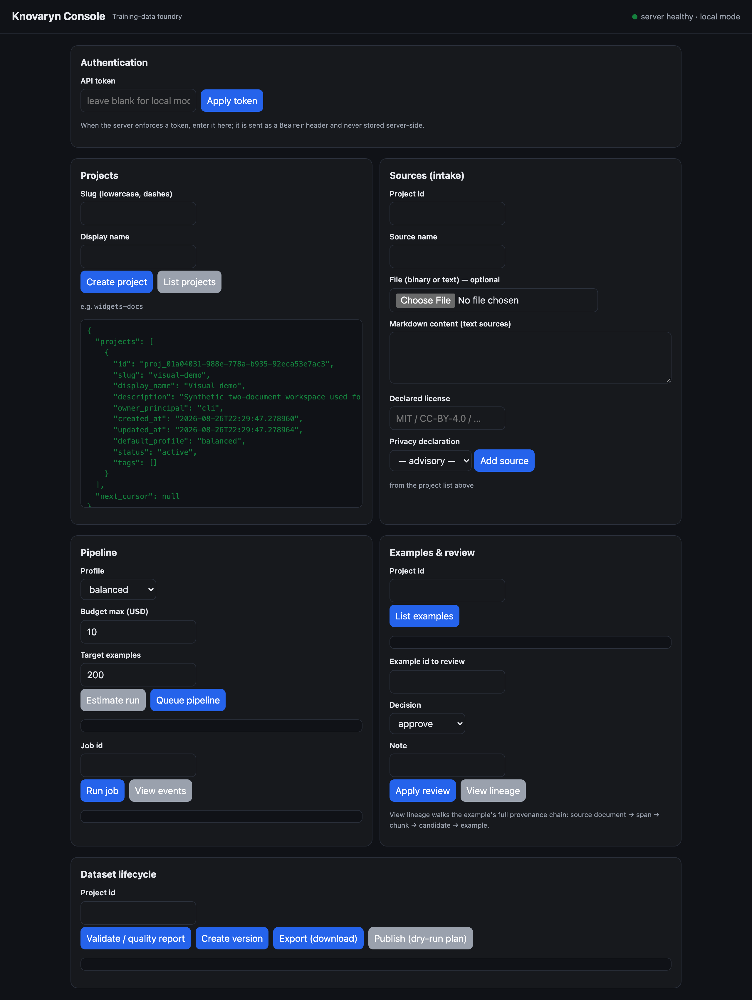

# Guides — 10-Minute Offline Quickstart

This guide gets a full pipeline running in about ten minutes with **no API keys
and no network**. It uses the deterministic **fake provider**, so install and
run are credential-free and reproducible.

Every command below exists on the real CLI — the
[CLI reference](../reference/cli.md) is generated from the app itself, so it
cannot drift from this page.

## 0. Install (uv)

Install [uv](https://docs.astral.sh/uv/) if you have not already, then install
Knovaryn in a virtualenv:

```bash
cd knovaryn
uv sync --extra dev            # lean core + dev tooling (no heavy ML extras)
```

The `uv sync` creates `.venv`. Prepend commands with `uv run` (or activate the
venv and drop the prefix). You do **not** need `docling`, `docetl`, `litellm`,
or any model extra for the offline demo.

## 1. Doctor

Check the environment, config, storage, and provider wiring:

```bash
uv run knovaryn doctor
```

This verifies the profile, installed extras, and state directory, and reports
anything misconfigured before you spend time. Fix warnings before continuing.

## 2. Run the bundled offline demo

Run the end-to-end demo to confirm the whole loop works on your machine:

```bash
uv run knovaryn demo --examples 20 --json
```

It creates a throwaway project, ingests bundled sample documents, generates on
the fake provider, validates, versions, and exports — the same loop you now
drive by hand.

## 3. Drive the CLI yourself

Now the same pipeline, command by command.

### Create a project

```bash
uv run knovaryn project create quickstart \
  --name "Quickstart Dataset" \
  --description "10-minute walkthrough"
```

Note the project handle (`proj_…`) in the output — every later command takes
it.

### Add a permitted source

```bash
uv run knovaryn source add <proj_handle> ./handbook.md \
  --license CC0 --privacy public
```

The source is preflighted (SHA-256, size, license, privacy classification) as
untrusted input. Inspect what was ingested:

```bash
uv run knovaryn source list <proj_handle>
```

{: width="1028" height="1852" loading=lazy }
*The same intake in the console's Sources panel — the preflight fields map
one-to-one to the `source add` flags.*

### Run generation

Nothing is spent until you ask for generation. The dry-run **cost estimate**
is available over MCP (`knovaryn_estimate_run`) and REST; on the CLI,
`run` starts the pipeline and enforces your spend cap:

```bash
uv run knovaryn run \
  --project <proj_handle> \
  --target 50 \
  --budget-usd 0
```

With the fake provider nothing can spend anyway; with real providers
`--budget-usd` is a hard cap. The job runs through the durable job engine
(leased worker, checkpoints, budgets) — watch it:

```bash
uv run knovaryn job list --project <proj_handle>
uv run knovaryn job status <job_handle>
```

### Review with evidence

Example handles (`ex_…`) appear in validation output and in the REST/MCP
listings. Record a review decision as an immutable revision:

```bash
uv run knovaryn review <ex_handle> approve \
  --reviewer alice --note "grounded in section 2"
```

### Validate, version, export

```bash
uv run knovaryn dataset validate <proj_handle>
uv run knovaryn dataset version <proj_handle> --set 1.0.0
uv run knovaryn dataset export <proj_handle> \
  --format openai_chat --out ./export
```

One canonical dataset version, exported per format id (`trl_sft`,
`trl_preference`, `kto`, `sharegpt`, `alpaca`, `openai_chat`,
`huggingface_layout`, `evaluation`, `jsonl`, `parquet` — the generated table in
the [exporter reference](../reference/exporters.md) is authoritative). Repeat
`dataset export` with another `--format` for additional trainer layouts.

## What you just did

permitted document → preflight → generation on the fake provider → validated,
reviewed examples with evidence → one versioned dataset exported to a
trainer-ready format. And it ran entirely offline.

The same loop also runs in a browser: `knovaryn server` serves a local web
console with the same controls.

{: width="1280" height="1700" loading=lazy }
*The console served by `knovaryn server` — every section drives the same REST
control plane used in this guide.*

The console adapts to the device and theme you already have — no settings of
its own:

{: width="588" height="4570" loading=lazy }
*375 px viewport: panels stack in one column; nothing is clipped or
collapsed away.*

{: width="1280" height="1700" loading=lazy }
*Dark scheme (`prefers-color-scheme: dark`): the same console, ink surfaces
and brightened accents.*

## Next

- Run the same loop through an MCP client: [MCP clients](mcp-clients.md).
- Start a real project with a local model provider:
  [first real project](first-real-project.md).
