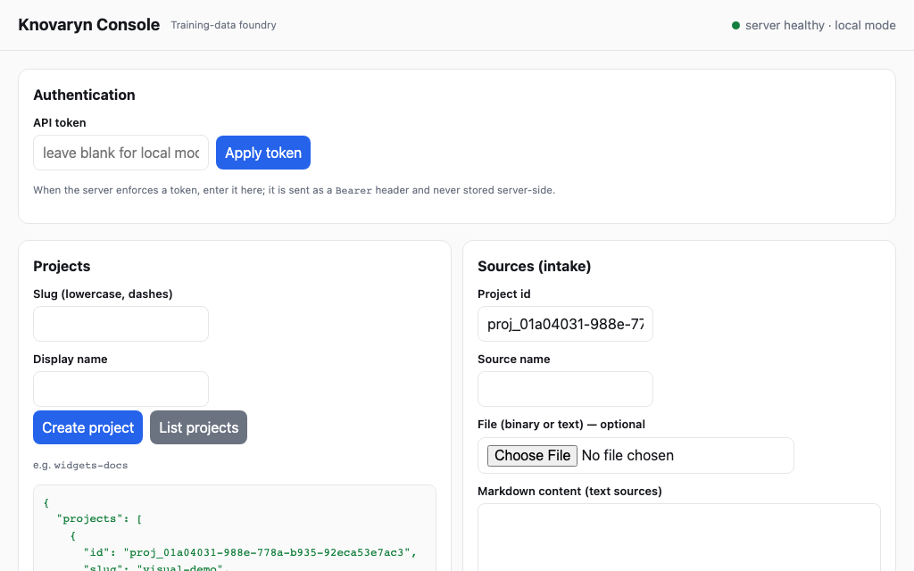

<!-- knovaryn-version: 0.2.2 -->

<div class="kn-hero">
  <span class="kn-pill kn-pill--alpha">Alpha · 0.2.2</span>
  <h1 class="kn-hero__title">Knovaryn</h1>
  <p class="kn-hero__lead"><strong>Every training example, traced to its source.</strong></p>
  <p class="kn-hero__lead">
    Turn permitted PDFs and documents into quality-gated SFT, preference,
    KTO, and evaluation datasets — with provenance enforced from source span
    through exported row.
  </p>
  <div class="kn-actions">
    <a class="kn-btn kn-btn--primary" href="#run-it-offline">Run offline demo</a>
    <a class="kn-btn kn-btn--secondary" href="guides/quickstart/">Read quickstart</a>
    <a class="kn-btn kn-btn--secondary" href="guides/mcp-clients/">Connect over MCP</a>
  </div>
</div>

```bash
pip install knovaryn
```

Knovaryn is an open-source, self-hosted **training-data foundry**: a CLI,
an MCP server, a REST control plane with a local web console, and a Python
SDK over the same application core. It runs local-first by default
(SQLite + filesystem) and scales to a team deployment (PostgreSQL +
S3-compatible storage) as configuration, not a fork.

## How it works

Select a stage to see what it does, what it records, how it fails, and the
exact command or tool that drives it. The full information on this page is
static HTML — it works with JavaScript disabled.

<div class="kn-tabs">

<input type="radio" name="kn-pipeline" id="kn-pipe-0" checked><label for="kn-pipe-0">Source</label>
<input type="radio" name="kn-pipeline" id="kn-pipe-1"><label for="kn-pipe-1">Parse</label>
<input type="radio" name="kn-pipeline" id="kn-pipe-2"><label for="kn-pipe-2">Split &amp; chunk</label>
<input type="radio" name="kn-pipeline" id="kn-pipe-3"><label for="kn-pipe-3">Plan</label>
<input type="radio" name="kn-pipeline" id="kn-pipe-4"><label for="kn-pipe-4">Generate</label>
<input type="radio" name="kn-pipeline" id="kn-pipe-5"><label for="kn-pipe-5">Validate</label>
<input type="radio" name="kn-pipeline" id="kn-pipe-6"><label for="kn-pipe-6">Review</label>
<input type="radio" name="kn-pipeline" id="kn-pipe-7"><label for="kn-pipe-7">Version</label>
<input type="radio" name="kn-pipeline" id="kn-pipe-8"><label for="kn-pipe-8">Export</label>

<div class="kn-tabpanels">

<section class="kn-panel">
  <p><strong>Ingest documents you are permitted to use — as untrusted input.</strong></p>
  <p><strong>Input:</strong> local files or paths (PDF, DOCX, Markdown, plain text).</p>
  <p><strong>Output:</strong> source records with SHA-256 digest, byte size, media type.</p>
  <p><strong>Provenance created:</strong> document IDs, content digests, license and privacy classification, group key.</p>
  <p><strong>Failure behavior:</strong> unknown or blocked licenses fail closed on the public path; preflight failures refuse ingestion rather than guessing.</p>
  <pre><code>knovaryn source add proj_… ./handbook.md --license CC-BY-4.0</code></pre>
  <p>MCP tool: <code>knovaryn_add_source</code> · report with <code>knovaryn_license_report</code>.</p>
  <p><a href="concepts/license-and-privacy/">License &amp; privacy gates →</a></p>
</section>

<section class="kn-panel">
  <p><strong>Convert documents into canonical, structured representations.</strong></p>
  <p><strong>Input:</strong> raw source bytes from intake.</p>
  <p><strong>Output:</strong> canonical DoclingDocument JSON for PDFs/office documents (Docling optional extra), built-in parsers for Markdown/plain text; derived markdown/text/tables.</p>
  <p><strong>Provenance created:</strong> parsed-document records and source spans with a machine-reported location precision (<code>exact_bbox</code>, <code>exact_page</code>, <code>page_range</code>, <code>section</code>, <code>chunk</code>) that reflects what the parser actually recorded.</p>
  <p><strong>Failure behavior:</strong> parsing runs behind a resource guard (memory limits, worker recycling); if the optional Docling extra is missing, PDF parsing is unavailable and <code>knovaryn doctor</code> reports it before you spend time.</p>
  <pre><code>knovaryn run --project proj_…   # parsing runs inside the durable job</code></pre>
  <p>MCP tool: <code>knovaryn_start_pipeline</code>.</p>
  <p><a href="architecture/diagram/#stage-notes">Stage notes →</a></p>
</section>

<section class="kn-panel">
  <p><strong>Split documents into generation-sized units without tearing structure apart.</strong></p>
  <p><strong>Input:</strong> normalized documents.</p>
  <p><strong>Output:</strong> structure-aware chunks — headings, tables, and lists stay together, with neighbor context; train/validation splits grouped by source so one document never crosses both.</p>
  <p><strong>Provenance created:</strong> chunk IDs carrying their <code>source_span_ids</code>.</p>
  <p><strong>Failure behavior:</strong> a source group too small to split is kept whole rather than leaking across boundaries.</p>
  <p>This stage runs inside the same durable job as parsing — checkpointed per stage, resumable without repeating earlier work.</p>
  <p>MCP tools: <code>knovaryn_start_pipeline</code> · inspect results with <code>knovaryn_preview_examples</code>.</p>
  <p><a href="architecture/diagram/">Pipeline flow →</a></p>
</section>

<section class="kn-panel">
  <p><strong>Decide what to generate — and what it will cost — before anything is spent.</strong></p>
  <p><strong>Input:</strong> your plan parameters: task-family mix, difficulty distribution, target size, spend cap.</p>
  <p><strong>Output:</strong> a generation profile across topologies (SFT, preference, KTO, evaluation) plus an estimated cost and expected yield checked against <code>budget.maximum_cost_usd</code>.</p>
  <p><strong>Provenance created:</strong> the plan itself, stored with the run.</p>
  <p><strong>Failure behavior:</strong> planning is a dry run — no model calls — so there is nothing to fail expensively.</p>
  <pre><code>knovaryn run --project proj_… \
  --family factual_explanation:1.0 --target 200 --budget-usd 5</code></pre>
  <p>MCP tool: <code>knovaryn_estimate_run</code> (dry-run cost estimate).</p>
  <p><a href="reference/config/">Configuration reference →</a></p>
</section>

<section class="kn-panel">
  <p><strong>Generate typed candidates through a provider-agnostic gateway.</strong></p>
  <p><strong>Input:</strong> chunks + plan.</p>
  <p><strong>Output:</strong> SFT, preference, KTO, and evaluation candidates from OpenAI-compatible, Anthropic-compatible, or DeepSeek endpoints — or the deterministic fake provider for fully offline runs.</p>
  <p><strong>Provenance created:</strong> generation candidate IDs on every example.</p>
  <p><strong>Failure behavior:</strong> <code>--budget-usd</code> is a hard cap; jobs checkpoint per stage, so a resumed run continues from the last completed stage instead of repeating already-paid model calls.</p>
  <pre><code>knovaryn job status job_…</code></pre>
  <p>MCP tools: <code>knovaryn_run_job</code> · watch with <code>knovaryn_get_job</code>.</p>
  <p><a href="guides/first-real-project/">First real project →</a></p>
</section>

<section class="kn-panel">
  <p><strong>Score every candidate against a dated acceptance policy — quarantine weak examples so they never export.</strong></p>
  <p><strong>Input:</strong> generated candidates.</p>
  <p><strong>Output:</strong> accepted examples and quarantined ones, each with per-dimension scores and reason codes.</p>
  <p><strong>Provenance created:</strong> quality assessments tied to candidate IDs.</p>
  <p><strong>Failure behavior:</strong> failures route to quarantine <em>with their cause recorded</em> — never silently dropped, never exported.</p>
  <pre><code>knovaryn dataset validate proj_…</code></pre>
  <p>MCP tool: <code>knovaryn_validate_dataset</code>.</p>
  <p><a href="concepts/quality/">Quality, deep dive →</a></p>
</section>

<section class="kn-panel">
  <p><strong>Put a human decision on top of machine judgment.</strong></p>
  <p><strong>Input:</strong> validated examples with their evidence.</p>
  <p><strong>Output:</strong> approve/reject decisions recorded as immutable revisions, with reviewer identity and note.</p>
  <p><strong>Provenance created:</strong> review revisions — who decided what, when, against which evidence.</p>
  <p><strong>Failure behavior:</strong> revisions are append-only; nothing is edited away.</p>
  <pre><code>knovaryn review ex_… approve --reviewer alice --note "grounded in page 3"</code></pre>
  <p>MCP tool: <code>knovaryn_review_example</code>.</p>
  <p><a href="concepts/quality-gates/">Quality gates →</a></p>
</section>

<section class="kn-panel">
  <p><strong>Freeze one canonical snapshot of the dataset.</strong></p>
  <p><strong>Input:</strong> accepted, reviewed examples.</p>
  <p><strong>Output:</strong> a semantic-versioned snapshot with manifest, quality report, dataset card, source manifest, license report, and privacy report.</p>
  <p><strong>Provenance created:</strong> the version record binding every exported row back to its evidence.</p>
  <p><strong>Failure behavior:</strong> versioning requires validation to have passed; you cannot freeze an ungoverned state.</p>
  <pre><code>knovaryn dataset version proj_… --set 1.0.0</code></pre>
  <p>MCP tool: <code>knovaryn_create_dataset_version</code>.</p>
  <p><a href="concepts/dataset-provenance/">Dataset provenance →</a></p>
</section>

<section class="kn-panel">
  <p><strong>Write trainer-ready formats from the one canonical version.</strong></p>
  <p><strong>Input:</strong> a frozen dataset version.</p>
  <p><strong>Output:</strong> JSONL, Parquet, TRL, ShareGPT, Alpaca, OpenAI chat, Hugging Face layout, and evaluation formats — repeat the command with another <code>--format</code>; the generated table in the exporter reference is authoritative.</p>
  <p><strong>Provenance created:</strong> export artifacts referencing the version they came from.</p>
  <p><strong>Failure behavior:</strong> optional publication is gated by license/privacy reports and requires an explicit confirmation token.</p>
  <pre><code>knovaryn dataset export proj_… --format openai_chat --out ./export</code></pre>
  <p>MCP tool: <code>knovaryn_export_dataset</code>.</p>
  <p><a href="reference/exporters/">Exporter reference →</a></p>
</section>

</div>
</div>

## Run it offline

No API keys, no network, no account:

```bash
pip install knovaryn
knovaryn demo --examples 20 --json
```

The demo ingests bundled sample documents, generates on the deterministic
fake provider, validates, versions, and exports — the whole loop in about a
minute, reproducible byte-for-byte. The ten-minute walkthrough then drives
the same loop command by command: [quickstart](guides/quickstart.md).

## Why Knovaryn

<div class="kn-cards">
<div class="kn-card">
  <h3 class="kn-card__title">Provenance by design</h3>
  <p class="kn-card__body">Every exported row carries <code>source_document_ids</code>, <code>source_span_ids</code>, a <code>content_hash</code>, and candidate IDs — walk any row back to the exact source spans it came from.</p>
  <p class="kn-card__scope"><strong>Scope:</strong> location precision reflects what the parser recorded — not every format yields bounding boxes.</p>
  <p class="kn-card__scope"><a href="concepts/provenance/">How the chain works →</a></p>
</div>
<div class="kn-card">
  <h3 class="kn-card__title">Fail-closed quality</h3>
  <p class="kn-card__body">A dated acceptance policy scores each candidate; weak ones are quarantined with reason codes and never reach export.</p>
  <p class="kn-card__scope"><strong>Limitation:</strong> deterministic heuristics measure policy compliance, not general entailment; certified-semantic checks need a configured judge, and unavailable judges fail closed.</p>
  <p class="kn-card__scope"><a href="concepts/quality/">The gate model →</a></p>
</div>
<div class="kn-card">
  <h3 class="kn-card__title">Durable jobs</h3>
  <p class="kn-card__body">Leased workers, checkpoints, budgets, and retries: a crashed run resumes from the last completed stage without repeating paid model calls.</p>
  <p class="kn-card__scope"><strong>Scope:</strong> multi-worker operation wants PostgreSQL; SQLite suits single-machine use.</p>
  <p class="kn-card__scope"><a href="architecture/jobs/">Job engine →</a></p>
</div>
<div class="kn-card">
  <h3 class="kn-card__title">MCP-native control</h3>
  <p class="kn-card__body">Drive the entire pipeline — sources, plans, runs, lineage, reviews, exports — from any MCP client. The catalogue is generated from the app.</p>
  <p class="kn-card__scope"><strong>Scope:</strong> compatibility is tested against MCP SDK 1.x and 2.x releases; upstream APIs still move.</p>
  <p class="kn-card__scope"><a href="guides/mcp-clients/">Connect a client →</a></p>
</div>
<div class="kn-card">
  <h3 class="kn-card__title">Offline-first workflow</h3>
  <p class="kn-card__body">Install, demo, and develop with zero credentials using the deterministic fake provider — the full pipeline, reproducible byte-for-byte.</p>
  <p class="kn-card__scope"><strong>Limitation:</strong> fake-provider output proves plumbing, not training signal — real data needs a real endpoint.</p>
  <p class="kn-card__scope"><a href="guides/quickstart/">Ten-minute quickstart →</a></p>
</div>
<div class="kn-card">
  <h3 class="kn-card__title">Provider &amp; trainer flexibility</h3>
  <p class="kn-card__body">Bring OpenAI-compatible, Anthropic-compatible, or DeepSeek endpoints; export one canonical dataset to the major trainer layouts.</p>
  <p class="kn-card__scope"><strong>Limitation:</strong> other providers mean speaking one of those protocols; no managed hosting is offered.</p>
  <p class="kn-card__scope"><a href="reference/exporters/">Formats →</a></p>
</div>
<div class="kn-card">
  <h3 class="kn-card__title">License &amp; privacy gates</h3>
  <p class="kn-card__body">Sources are classified at intake; blocked or unknown licenses fail closed on the public path, and publication is gated by license and privacy reports.</p>
  <p class="kn-card__scope"><strong>Limitation:</strong> these gates are safety rails, not legal clearance or legal advice.</p>
  <p class="kn-card__scope"><a href="concepts/license-and-privacy/">Gates in detail →</a></p>
</div>
<div class="kn-card">
  <h3 class="kn-card__title">Reproducible releases</h3>
  <p class="kn-card__body">Frozen dataset versions bundle manifest, quality/license/privacy reports, and checksums — verify any release artifact after the fact.</p>
  <p class="kn-card__scope"><strong>Scope:</strong> regeneration reproduces given the same inputs; generated text itself depends on provider behavior.</p>
  <p class="kn-card__scope"><a href="concepts/dataset-provenance/">Versioning →</a></p>
</div>
</div>

## Interfaces

All four sit on the same application-services core:

- **CLI** — `knovaryn` ([generated command table](reference/cli.md)): lifecycle
  groups `project`, `source`, `run`, `job`, `review`, `dataset`, plus
  operational commands `demo`, `init`, `doctor`, `repair`, `backup`,
  `restore`, `server`, `worker`, `mcp`, `verify-release`, `version`.
- **MCP server** — `knovaryn-mcp` (or `knovaryn mcp`); catalogue in the
  [generated tool reference](reference/mcp-tools.md), env prefix `KNOVARYN_`.
- **REST control plane + local web console** — `knovaryn server`
  ([endpoint table](reference/rest-api.md)).

<figure class="kn-figure">
  <a href="assets/screenshots/offline-demo.gif"></a>
  <figcaption><strong>The web console</strong> — served by <code>knovaryn server</code>. The linked 24-second animation (deliberately not autoplayed) walks source → run → quality result → provenance → export against the deterministic demo workspace; a full transcript is in <a href="https://github.com/waalwalker1/knovaryn/blob/main/scripts/visuals/record_demo/">record_demo.md</a>.</figcaption>
</figure>
- **Python SDK** — the `Workspace` application core.

## Trust and evidence

Verifiable engineering facts, linked at the source — no numbers here that
rot:

<div class="kn-evidence">
<div class="kn-metric">
  <div class="kn-metric__value"><span class="kn-pill kn-pill--alpha">Alpha</span></div>
  <p class="kn-metric__label">Current release: <code>0.2.2</code> on PyPI — expect API changes until 1.0.</p>
  <p class="kn-metric__source"><a href="https://pypi.org/project/knovaryn/">PyPI</a> · <a href="https://github.com/waalwalker1/knovaryn/releases">Releases</a> · <a href="https://github.com/waalwalker1/knovaryn/blob/main/CHANGELOG/">Changelog</a></p>
</div>
<div class="kn-metric">
  <div class="kn-metric__value">Python ≥ 3.11</div>
  <p class="kn-metric__label">Tested across supported Python majors in CI; MCP SDK 1.x <em>and</em> 2.x verified cell-by-cell.</p>
  <p class="kn-metric__source"><a href="https://github.com/waalwalker1/knovaryn/blob/main/pyproject.toml">pyproject.toml</a> · <a href="adr/0007-dual-major-mcp-sdk-compatibility/">ADR-0007</a> · <a href="https://github.com/waalwalker1/knovaryn/actions/workflows/compat.yml">compat CI</a></p>
</div>
<div class="kn-metric">
  <div class="kn-metric__value">CI-gated</div>
  <p class="kn-metric__label">Lint, strict typing, tests with a coverage floor, pip-audit, Trivy container/IaC scanning on every change.</p>
  <p class="kn-metric__source"><a href="https://github.com/waalwalker1/knovaryn/actions/workflows/ci.yml">ci.yml</a> · <a href="https://github.com/waalwalker1/knovaryn/actions/workflows/security.yml">security.yml</a></p>
</div>
<div class="kn-metric">
  <div class="kn-metric__value">Signed supply chain</div>
  <p class="kn-metric__label">Every GitHub release ships SBOM (CycloneDX) + SHA256SUMS; <code>knovaryn verify-release</code> checks a downloaded bundle; deployments are tested against the published tag before publish completes.</p>
  <p class="kn-metric__source"><a href="security/governance-and-ci/">Governance &amp; CI →</a></p>
</div>
<div class="kn-metric">
  <div class="kn-metric__value">Claim discipline</div>
  <p class="kn-metric__label">Every public claim — capability, benchmark, compatibility — is mapped to its executable evidence in the claim matrix.</p>
  <p class="kn-metric__source"><a href="reference/claim-matrix/">Claim matrix →</a></p>
</div>
<div class="kn-metric">
  <div class="kn-metric__value">No telemetry</div>
  <p class="kn-metric__label">Zero third-party requests on this site; no analytics in the product; your documents never leave your machine unless you point Knovaryn at a provider.</p>
  <p class="kn-metric__source"><a href="security/privacy-licensing/">Privacy &amp; licensing →</a></p>
</div>
</div>

## Start from your task

<ul class="kn-tasks">
  <li><a href="guides/quickstart/">Get started</a></li>
  <li><a href="guides/pdf-to-sft-dataset/">Build an SFT dataset</a></li>
  <li><a href="guides/build-dpo-preference-data/">Build preference data</a></li>
  <li><a href="guides/mcp-clients/">Use Knovaryn over MCP</a></li>
  <li><a href="tours/provenance-tour/">Inspect provenance</a></li>
  <li><a href="tours/quality-gates-tour/">See the gates decide</a></li>
  <li><a href="deployment/profiles/">Deploy for a team</a></li>
  <li><a href="guides/hugging-face-export/">Export and publish</a></li>
  <li><a href="https://github.com/waalwalker1/knovaryn/blob/main/CONTRIBUTING/">Contribute</a></li>
  <li><a href="support/">Troubleshoot</a></li>
</ul>

New to the ecosystem? The [Knovaryn MCP overview](knovaryn-mcp.md) explains
how the pieces work together as a product.

## Honest limitations

- Quality gates measure compliance with the configured policy; they do
  **not** guarantee the absence of bias or hallucination, nor that a dataset
  improves any particular model.
- License handling gates blocked/unknown sources on the public path — it is
  **not** legal clearance.
- Deterministic heuristics do not prove general entailment;
  `certified-semantic` requires a configured judge, and unavailable judges
  fail closed.
- This is alpha software (`0.2.2`): APIs are not stabilized, and there is no
  hosted service — you self-host.

## License

Apache-2.0. See the [license and privacy notes](concepts/license-and-privacy.md)
for what that means for generated data.
