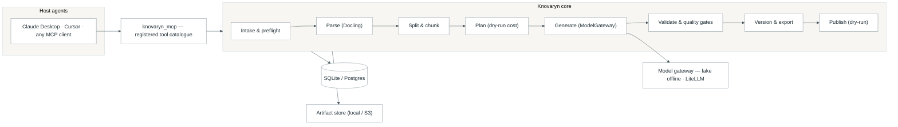

# Knovaryn MCP — ecosystem overview

> **From unstructured documents to trainer-ready datasets — over the Model
> Context Protocol.**

The Knovaryn MCP ecosystem is an open
ecosystem for turning the raw PDFs, slides, HTML, and notes you're *permitted*
to use into **traceable, quality-gated SFT &amp; preference datasets** any
MCP-capable agent can build on demand.

At the center is **Knovaryn**, an **MCP-native training-data foundry**:

> Turn *permitted* documents into *traceable, quality-gated* SFT & preference
> datasets that any MCP-capable agent can build, review, and export.

```
Source documents ──▶ Parse ──▶ Split & chunk ──▶ Generate ──▶ Validate ──▶ Export ──▶ Publish
  (PDF · PPTX · HTML)   (Docling)     (provenance)   (SFT/pref/KTO)  (fail-closed gates)  (JSONL · HF)
```

## Why it matters

| Problem today | What this project changes |
|---|---|
| Unstructured data sits unused — no one can load a 400-slide deck into a model. | **Universal ingestion** turns permitted documents into clean, chunked, annotated Markdown derivatives. |
| Training-data pipelines are opaque; you can't tell where a row came from. | **Provenance by design** — every example points back to its source spans with machine-reported location precision. |
| Weak or unsafe examples ship silently. | **Fail-closed quality gates that quarantine failures** instead of exporting them. |
| Expensive generation work is lost on every crash. | **Durable jobs** — atomic claims, heartbeats, resume-from-checkpoint, budget caps. |
| Licensing and privacy are an afterthought. | **License registry + publication gate**; secrets from environment only; dry-run by default. |
| Provider & trainer lock-in. | **Provider-agnostic model gateway** + native exporters for TRL, ShareGPT/Alpaca, OpenAI chat, Parquet, and Hugging Face. |

## How the whole system works

A high-level view of the end-to-end architecture. Switch among eight
interactive views — **system architecture**, **pipeline flow**, **durable
jobs**, **provenance chain**, **MCP session**, **security boundaries**,
**deployment topology**, and the **release supply chain** — in the
[architecture explorer](architecture/explorer.md), or browse every diagram
with its raw Mermaid source on
[Architecture at a glance](architecture/readme-diagrams.md).



**Key idea:** every stage is a *durable job*. If the machine crashes mid-run, the
lease expires, the job **resumes from its last checkpoint**, and no paid work is
re-generated. Everything funnels through one application core, so the **CLI,
MCP, REST, and Python SDK all see the same jobs, the same audit trail, and the
same provenance.**

## Product, library, or service?

**It's all three**, from one codebase:

- **Product** — installable application with a CLI, local web console, REST
  control plane, and a polished MCP tool suite. Works fully offline.
- **Library / SDK** — embed dataset-building in your own agents and pipelines
  via the Python SDK.
- **Service** — over MCP or REST it behaves like a managed capability your
  agents call on demand: *"ingest this, build SFT + preference data, gate it,
  and hand me a trainer-ready bundle."*

## Getting started

```bash
git clone https://github.com/waalwalker1/knovaryn.git
cd knovaryn
uv sync --dev

uv run knovaryn doctor                       # check your environment
uv run knovaryn demo --examples 20 --json    # full offline pipeline on sample docs
uv run knovaryn server --host 127.0.0.1 --port 8000   # REST API + web console
```

Connect any MCP-capable agent (Claude Desktop, Cursor, and other MCP clients) to the
`knovaryn_mcp` server and let it build, review, validate, and export datasets on
your behalf.

## Security

Knovaryn reads credentials **only from the environment** — no API keys are
committed anywhere, the demo needs none at all, and secrets are redacted at
display boundaries. See the placeholder-only
[`.env.example`](https://github.com/waalwalker1/knovaryn/blob/main/.env.example)
for the complete configuration reference. Publication is **dry-run by default**
and gated on license approval.

For the product detail, head to the [Knovaryn index](index.md).
